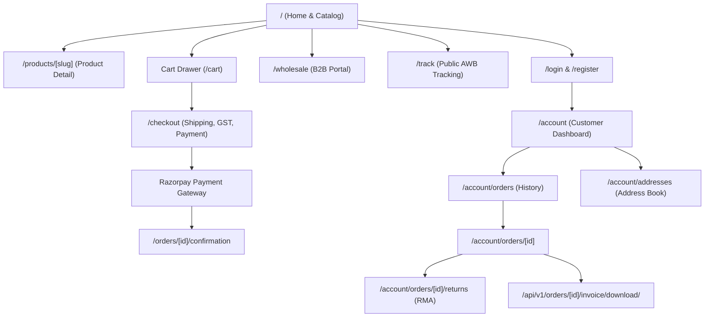

# Frontend Architecture & Design System Analysis: Bharath Masala

**Project:** Bharath Masala E-Commerce Platform  
**Target Backend:** Django REST Framework API (80 routes, 94 operations, OpenAPI 3.0.3 verified)  
**Document Purpose:** Comprehensive audit of existing frontend artifacts, design system evaluation, visual identity preservation strategy, and technical blueprint for backend integration.

---

## 1. Executive Summary

An audit of the frontend assets reveals an existing prototype built as a single-page landing site titled **"Masala Box"**. 

The prototype was constructed as a luxury dining/restaurant concept (featuring table reservations, Chinese-Indian wok dishes, and static menus), rather than a statutory, packaged spice manufacturing and wholesale e-commerce platform (**Bharath Masala Products**).

However, the prototype possesses a **distinctive, high-craft visual identity**:
- Refined luxury typography combining `Playfair Display` serif headers with `Poppins` clean sans-serif body copy.
- Signature micro-interactions: an animated dotted `.spice-trail` divider, floating warm `.particle` embers and rising `.steam`, interactive `.dish-card` hover states, and smooth `.glass` backdrop navigation.
- A responsive layout foundation using **Next.js 14 App Router** and **Tailwind CSS**.

### Strategic Directive
1. **Preserve and elevate the visual craftsmanship**: Retain the animations, typography, card hover dynamics, drawer mechanics, and aesthetic warmth that give the site its artisanal character.
2. **Discard restaurant-specific paradigms**: Remove table booking, restaurant menu categories (fried rice, momos, noodles), and mock restaurant JSON data.
3. **Re-architect as an enterprise e-commerce storefront**: Integrate directly with the verified Django backend endpoints (JWT auth, guest/auth cart synchronization, variant-based spice purchasing, statutory GST tax invoices, Razorpay checkout, shipment tracking, and RMA customer returns).

---

## 2. Current Project Architecture

### 2.1 Technology Stack & Dependencies

```json
{
  "name": "masala-box",
  "version": "1.0.0",
  "private": true,
  "scripts": {
    "dev": "next dev",
    "build": "next build",
    "start": "next start",
    "lint": "next lint"
  },
  "dependencies": {
    "next": "14.2.35",
    "react": "^18.3.1",
    "react-dom": "^18.3.1"
  },
  "devDependencies": {
    "autoprefixer": "^10.4.19",
    "postcss": "^8.4.40",
    "tailwindcss": "^3.4.7"
  }
}
```

- **Framework:** Next.js `14.2.35` utilizing the **App Router** (`app/` directory).
- **Core Library:** React `18.3.1` (Client-side rendering via `'use client'` on `<SiteClient />`).
- **Styling Engine:** Tailwind CSS `3.4.7` with PostCSS `8.4.40` and Autoprefixer `10.4.19`.
- **Language:** JavaScript (ES6+ / JSX) — currently lacks TypeScript typing, runtime schema validation (Zod), or API client abstractions.
- **Font Delivery:** `next/font/google` self-hosting `Playfair_Display` and `Poppins`.

### 2.2 Directory Structure

```
frontend/
├── app/
│   ├── globals.css          # Tailwind directives, custom keyframes, scrollbar styling
│   ├── layout.js            # Root layout, Google font variables, metadata
│   └── page.js              # Root route entrypoint (renders <SiteClient />)
├── components/
│   ├── About.jsx            # Brand story + animated metric counters
│   ├── CartDrawer.jsx       # Slide-out drawer with cart items, total, remove action
│   ├── Contact.jsx          # Hours, phone, email, Google Maps embed
│   ├── FloatingButtons.jsx  # WhatsApp floating link + scroll-to-top trigger
│   ├── Footer.jsx           # 4-column brand, links, hours, newsletter
│   ├── Gallery.jsx          # CSS grid of food icons and gradient tiles
│   ├── Hero.jsx             # Fullscreen hero banner with ember canvas and CTA buttons
│   ├── Menu.jsx             # Filterable category grid + DishCard subcomponent
│   ├── Navbar.jsx           # Sticky glassmorphism header with scroll listener
│   ├── Offers.jsx           # Promotional discount highlight cards
│   ├── Reservation.jsx      # Dummy table reservation form with local timer
│   ├── Reviews.jsx          # Infinite horizontal marquee testimonial track
│   ├── Shared.jsx           # Shared primitives: useReveal, EmberField, SpiceTrail, SectionTag
│   ├── SiteClient.jsx       # State container (cart array, cartOpen boolean)
│   ├── SpecialDishes.jsx    # 4-item chef highlights card grid
│   └── WhyChooseUs.jsx      # 6 feature badges
├── data/
│   ├── menu.json            # 137 hardcoded restaurant dishes (name, store_price, online_price)
│   └── menuHelpers.js       # Category mapping, icon mapping, formatting helper fmt()
├── next.config.js           # Minimal Next.js configuration
├── package.json             # NPM dependencies and scripts
├── postcss.config.js        # PostCSS configuration
└── tailwind.config.js       # Color tokens, fonts, shadow definitions
```

---

## 3. Existing Pages & Routing Architecture

### 3.1 Routing Model
The current frontend is strictly a **Single Page Application (SPA) landing page**. There is only one route:
- **`/` (`app/page.js`)**: Imports and mounts `<SiteClient />`.

All navigation links in the header and footer rely on **anchor hash scrolling**:
- `#home` $\to$ Hero
- `#about` $\to$ Brand Story & Metrics
- `#our-menu` $\to$ Menu Filter & Product Grid
- `#special-offers` $\to$ Promotional Cards
- `#gallery` $\to$ Image Collage
- `#reviews` $\to$ Marquee Testimonials
- `#reservation` $\to$ Table Booking Form
- `#contact` $\to$ Location & Hours

### 3.2 State Management
State is managed purely at the component level via React `useState`:
- **`SiteClient.jsx`**:
  - `cart`: Array of items `[{ id, displayName, online_price, icon, ... }]`.
  - `cartOpen`: Boolean controlling `<CartDrawer />` visibility.
  - `addToCart(item)`: Pushes a new item into the array without quantity accumulation or variant distinction.
  - `removeFromCart(idx)`: Filters by array index.
- **`Menu.jsx`**: Local state for `active` category filter, `query` search text, and `sort` ordering.
- **`Navbar.jsx`**: Local state for `scrolled` (scrollY > 40px) and mobile menu `open`.
- **`Reservation.jsx`**: Local state for form inputs and a mock `sent` confirmation banner.

**Critical Deficiencies in State Architecture:**
1. **No Persistence:** Cart is wiped clean upon browser refresh or tab close.
2. **No Guest Token Handling:** Does not read or manage the backend's `guest_cart_token` cookie.
3. **No Auth State:** No storage or context for JWT access tokens, user profile, or wholesale approval status.
4. **No API Fetch Layer:** Zero network calls; all data is statically imported from `data/menu.json`.

---

## 4. Design System & Visual Identity Analysis

### 4.1 Color Palette

The codebase contains tokens from two design iterations. The existing `tailwind.config.js` and `app/globals.css` implement a **Clean Mist & Blue** palette, while retaining semantic token names from an earlier **Dark-Luxury Turmeric & Gold** theme.

#### Current Active Tokens (in `tailwind.config.js`)
| Token Name | Hex Value | Role in UI | Intended Visual Feel |
| :--- | :--- | :--- | :--- |
| `ink` | `#F4F8FC` | Page body background | Soft mist white |
| `charcoal` | `#E9F0FA` | Alternating section background | Pale ice blue |
| `charcoal2` | `#FFFFFF` | Card surfaces & modal backgrounds | Pure crisp white |
| `gold` | `#2F6FED` | Primary brand accent & buttons | Royal Cobalt Blue |
| `goldSoft` | `#5B90F5` | Hover states on primary buttons | Soft Cerulean |
| `ember` | `#8B7CF6` | Secondary gradient accent & badges | Lavender / Violet |
| `cream` | `#1E2A3A` | Primary typography & headings | Deep Slate Navy |

#### Recommended Color Strategy for Bharath Masala
While the cool mist-white/blue palette (`#F4F8FC` / `#2F6FED`) provides a clean modern look, Bharath Masala is an **authentic Malenadu heritage spice brand** (Thirthahalli, Karnataka). 
A palette reflecting Western Ghats soil, turmeric, whole cardamom, and aged pepper evokes authentic spice terroir:
- **Primary Spice Gold / Turmeric:** `#D4AF37` (Accent) / `#B8860B` (Darker Gold)
- **Deep Malenadu Earth / Espresso:** `#171310` (Dark contrast) / `#1C1917` (Stone)
- **Cardamom Leaf Green (Fresh / Organic):** `#2D5A27` / `#3B7A34`
- **Chilli Ember / Terracotta:** `#E05A2B` (Sale badges & alerts)
- **Warm Parchment / Cream:** `#FDFBF7` (Background) / `#F5EFEB` (Surface)

The component styles can easily be parameterized using CSS variables to support either the **Warm Heritage Spice Theme** or the **Crisp Modern Artisan Theme** seamlessly.

### 4.2 Typography
- **Display Serif:** `Playfair Display` (`--font-playfair`, weights: 500, 600, 700, 800; normal & italic).
  - Used for: Brand logo (`MASALA BOX`), hero headlines, section titles, dish names, and metric numbers.
  - Evaluation: **Exceptional quality.** Gives the product line an artisanal, premium estate packaging aesthetic. Must be preserved.
- **Body Sans-serif:** `Poppins` (`--font-poppins`, weights: 300, 400, 500, 600, 700).
  - Used for: Navigation links, body copy, descriptions, price tags, button labels, and form controls.
  - Evaluation: Clean, geometric, highly legible at small sizes across mobile and desktop. Must be preserved.

### 4.3 Custom Animations & Visual Effects (`globals.css`)
1. **`.spice-trail`**:
   - Continuous 6-second linear animation moving a radial-gradient dot pattern across a 2px horizontal line.
   - Distinctive visual separator placed beneath section headings.
2. **`.particle` & `.steam` (`EmberField`)**:
   - Drifting circular particles floating upward with variable duration, delay, and opacity.
   - Simulates rising aroma, embers, or culinary mist.
3. **`.glass`**:
   - Frosted glass effect using `backdrop-filter: blur(14px) saturate(140%)` and semi-transparent background.
   - Used on the sticky header and mobile navigation drawer.
4. **`.dish-card` Hover Dynamics**:
   - Smooth cubic-bezier elevation (`translateY(-8px) scale(1.015)`) with multi-layered blue/gold glow shadows and border highlighting.
5. **`.marquee-track`**:
   - 34-second infinite horizontal scroll displaying review cards.
6. **`.btn-golden`**:
   - Pill-shaped buttons with animated border and background color transitions.

---

## 5. Component-by-Component Assessment

| Component | Current Implementation | Verdict | Recommended Action |
| :--- | :--- | :--- | :--- |
| **`Navbar.jsx`** | Sticky frosted header, anchor links, cart badge count, "Reserve a Table" button, mobile hamburger drawer. | **PRESERVE & ADAPT** | Update links to e-commerce routes (Shop, Categories, Heritage/About, B2B Wholesale, Track Order). Replace "Reserve a Table" with **"Login / Account"** or **"Wholesale Portal"**. Wire cart badge to backend cart count. |
| **`Hero.jsx`** | Fullscreen banner, floating embers, "MASALA BOX - Indo-Chinese Fusion Dining", two CTA buttons. | **PRESERVE & ADAPT** | Retain ember effect, typography, and CTA structure. Update brand title to **"BHARATH MASALA"**, subtitle to **"Pure Heritage Spices from the Western Ghats"**, and CTAs to "Explore Spices" and "Wholesale Enquiries". |
| **`About.jsx`** | 2-column layout, placeholder image box, brand narrative, 3 animated metric counters. | **PRESERVE & ADAPT** | Retain counter mechanics and spice trail. Update copy to reflect Sharada's oral culinary stories, Thirthahalli Malenadu terroir, cold-ground processing, and 100% pure FSSAI-certified spice blends. |
| **`Menu.jsx`** | Category filter pills, search input, sort dropdown, grid of 137 restaurant dishes with + add button. | **REDESIGN** | Transform into **`ProductCatalog.jsx`**. Connect to `GET /api/v1/catalog/products/` with dynamic query parameters (`?category=`, `?search=`, `?ordering=`). Replace dish cards with true e-commerce product cards. |
| **`DishCard`** | Emoji icon container, category name, title, online price vs store price, + button. | **REDESIGN** | Transform into **`ProductCard.jsx`**. Support real product photography, pack-size variant selector (e.g., 100g, 250g, 500g), retail price vs MRP discount display, B2B wholesale tag, stock status badge (In Stock / Low Stock), and direct cart integration. |
| **`SpecialDishes.jsx`** | 4-card grid highlighting signature restaurant items (Momos, Fried Rice). | **REDESIGN** | Transform into **`FeaturedSpices.jsx`** or **`Bestsellers.jsx`** showcasing flagship blends (e.g., Malenadu Sambar Powder, Royal Garam Masala, Malabar Black Pepper, Salem Turmeric). |
| **`Offers.jsx`** | 4 static offer cards ("Buy 2 Get 1", "Weekend Combo", "Free Drink"). | **REDESIGN** | Transform into **`PromotionsSection.jsx`**. Connect to backend promotion models (`apps.promotions`) displaying real coupon codes (`WELCOME10`, volume tier discounts) that users can copy and apply to their cart. |
| **`WhyChooseUs.jsx`** | 6 grid badges (Fresh Ingredients, Experienced Chefs, Fast Delivery). | **PRESERVE & ADAPT** | Retain visual grid. Adapt badges to spice manufacturing standards: **"Single-Origin Western Ghats"**, **"Zero Adulteration / FSSAI Certified"**, **"Traditional Cold Ground"**, **"Aroma-Lock Packaging"**, **"Pan-India Fast Dispatch"**, **"B2B Wholesale Available"**. |
| **`Gallery.jsx`** | 9-tile CSS grid with food emojis and color gradients. | **PRESERVE & ADAPT** | Retain the responsive grid layout. Replace emoji tiles with authentic imagery of spice plantations, whole spice harvests (cardamom pods, clove clusters, cinnamon barks), and packaged products. |
| **`Reviews.jsx`** | Infinite horizontal marquee with star ratings and reviewer avatars. | **PRESERVE & ADAPT** | Retain marquee animation. Wire into backend product reviews API (`GET /api/v1/catalog/products/{slug}/reviews/`) displaying verified buyer badges and real feedback. |
| **`Reservation.jsx`** | Table booking form (Name, Phone, Guests, Date, Time) with mock submit. | **REMOVE / REPLACE** | Table reservation does not apply to a spice e-commerce brand. Replace with **`WholesaleEnquiry.jsx`** (B2B wholesale inquiries) or a **`RecipeGuide.jsx`** interactive culinary guide. |
| **`Contact.jsx`** | Contact details (Phone, Email, Hours), social links, Google Maps iframe. | **PRESERVE & ADAPT** | Update details to Bharath Masala Products (Main Road, Thirthahalli, Shimoga District, Karnataka 577432; GSTIN: 29AAAAA0000A1Z5; FSSAI: 11223344556677). Update Map embed to Thirthahalli. |
| **`Footer.jsx`** | 4-column footer with newsletter signup, links, and copyright. | **PRESERVE & ADAPT** | Retain layout. Add legal & regulatory links (Privacy Policy, Terms of Service, Return & RMA Policy, FSSAI Details, GST Compliance). Wire newsletter input to notification subscription. |
| **`CartDrawer.jsx`** | Slide-out drawer, naive list of items, subtotal calculation, non-functional "Checkout" button. | **REDESIGN** | Connect directly to backend cart API (`/api/v1/cart/`). Display line items with pack-size variants, item-level quantity steppers (`+`/`-`), coupon code application input with discount breakdown, GST summary, and a functional button navigating to `/checkout`. |
| **`FloatingButtons.jsx`**| Floating WhatsApp chat link and scroll-to-top button. | **PRESERVE** | Maintain high utility. Update WhatsApp phone number to official customer support number. |
| **`Shared.jsx`** | `useReveal`, `EmberField`, `SpiceTrail`, `SectionTag`. | **PRESERVE** | Core UI primitives providing brand identity across all pages. Retain in full. |

---

## 6. Gaps & Missing Pages for Full Backend Integration

The Django backend provides 80 routes and 94 operations. To be a complete, production-grade e-commerce application, the frontend must expand from a single-page landing site into a **multi-page storefront with authenticated flows**:



### Critical Missing Pages & Flows:

### 1. Product Detail Page (`/products/[slug]`)
- **Backend API:** `GET /api/v1/catalog/products/{slug}/`
- **Required UI:**
  - High-resolution image gallery with thumbnail switcher.
  - Tier & Form indicators (e.g. *Reserve Tier · Whole Spice*).
  - Pack-size variant selector buttons (e.g., `100g`, `250g`, `500g`, `1kg`) dynamically updating SKU, retail price, and stock status.
  - Wholesale pricing tier banner (e.g., *Wholesale price available for verified B2B accounts*).
  - Terroir and culinary story ("Sharada's Kitchen Notes", origin region, harvesting season).
  - Legal Metrology & FSSAI statutory panel (ingredients, shelf life, manufacturer address).
  - Verified customer reviews list + review submission form (`POST /api/v1/catalog/products/{slug}/reviews/`).

### 2. Authentication & Account Management (`/login`, `/register`, `/wholesale/register`)
- **Backend APIs:**
  - `POST /api/v1/auth/login/` (stores JWT access token, handles HttpOnly refresh cookie)
  - `POST /api/v1/auth/register/` (retail customer onboarding)
  - `POST /api/v1/auth/register/wholesale/` (B2B wholesale onboarding with GSTIN, PAN, trade name, annual turnover)
  - `POST /api/v1/auth/logout/`
  - `GET/PATCH /api/v1/auth/me/`
- **Required UI:**
  - Modal or standalone authentication screens with tab switching between Retail and Wholesale.
  - GSTIN validation and automatic business state assignment.
  - User profile drawer/page showing current wholesale verification status (`PENDING`, `VERIFIED`, `REJECTED`).

### 3. Customer Address Book (`/account/addresses`)
- **Backend APIs:** `GET/POST /api/v1/auth/addresses/`, `PATCH/DELETE /api/v1/auth/addresses/{id}/`, `POST /api/v1/auth/addresses/{id}/set-default/`
- **Required UI:**
  - Saved addresses list with "Default Shipping" and "Default Billing" badges.
  - Address creation/edit modal with Indian state selector (matching `IndianStates` backend choices) and 6-digit PIN code validation.

### 4. Enterprise Checkout Flow (`/checkout`)
- **Backend APIs:** `POST /api/v1/orders/checkout/`, `POST /api/v1/payments/orders/{order_id}/initiate/`, `POST /api/v1/payments/orders/{order_id}/verify/`
- **Required UI:**
  - **Step 1: Shipping Address Selection** (choose from address book or enter new address).
  - **Step 2: Order Review & Pricing Breakdown**:
    - Itemized line items with variant pack size.
    - Subtotal, volume discount / coupon discount line.
    - Statutory GST breakdown (CGST + SGST for Karnataka intrastate, IGST for interstate).
    - Delivery fee calculation.
  - **Step 3: Razorpay Payment Trigger**:
    - Razorpay Standard Checkout SDK modal integration with auto-filled customer phone and email.
    - Instant signature verification callback handling.

### 5. Order Confirmation & Tracking (`/orders/[id]`, `/track`)
- **Backend APIs:** `GET /api/v1/orders/{id}/`, `GET /api/v1/shipping/orders/{order_id}/tracking/`, `GET /api/v1/shipping/track/?awb=...`
- **Required UI:**
  - Order status progress tracker: `PENDING` $\to$ `CONFIRMED` $\to$ `PROCESSING` $\to$ `SHIPPED` $\to$ `DELIVERED`.
  - Live consignment tracking details: Carrier name, AWB number, live checkpoint updates.
  - Quick action: **Download GST Tax Invoice (PDF)** (`GET /api/v1/orders/{id}/invoice/download/`).
  - Quick action: **Cancel Order** (`POST /api/v1/orders/{id}/cancel/` — available before shipment dispatch).

### 6. Customer Returns & RMA Portal (`/orders/[id]/returns`)
- **Backend APIs:** `GET/POST /api/v1/orders/{order_id}/returns/`, `POST /api/v1/orders/{order_id}/returns/{id}/cancel/`
- **Required UI:**
  - Return window validator (displays eligibility within the statutory 7-day policy window).
  - Item selector with returnable quantity limit.
  - Reason selector (`DAMAGED_IN_TRANSIT`, `QUALITY_ISSUE`, `INCORRECT_ITEM_SENT`, etc.).
  - Resolution selector: **Refund to Source** vs **Replacement Consignment**.
  - Return status timeline showing reverse courier pickup scheduling, warehouse receipt, inspection, and credit note issuance.

---

## 7. Recommended Production Frontend Architecture

```
frontend/
├── app/
│   ├── (auth)/
│   │   ├── login/page.jsx
│   │   ├── register/page.jsx
│   │   └── wholesale/page.jsx
│   ├── (shop)/
│   │   ├── layout.jsx                # Shared header, cart drawer, footer
│   │   ├── page.jsx                  # Homepage with Hero, Featured, Story, Catalog
│   │   ├── products/
│   │   │   └── [slug]/page.jsx       # Dynamic Product Detail Page (PDP)
│   │   ├── checkout/page.jsx         # 3-step checkout with Razorpay modal
│   │   └── track/page.jsx            # Public AWB tracking portal
│   ├── account/
│   │   ├── layout.jsx                # Authenticated customer portal layout
│   │   ├── page.jsx                  # Overview
│   │   ├── orders/
│   │   │   ├── page.jsx              # Order history
│   │   │   └── [id]/page.jsx         # Order detail, tracking, returns, invoice
│   │   └── addresses/page.jsx        # Saved addresses management
│   ├── globals.css
│   └── layout.jsx
├── components/
│   ├── ui/                           # Reusable UI library (Button, Modal, Input, Badge)
│   ├── layout/                       # Navbar, Footer, MobileNav, FloatingButtons
│   ├── catalog/                      # ProductCard, VariantSelector, ProductGrid, FilterBar
│   ├── cart/                         # CartDrawer, CartItem, CouponInput, PriceSummary
│   ├── checkout/                     # AddressSelector, PaymentTrigger, OrderSummary
│   ├── shared/                       # SpiceTrail, EmberField, Counter, SectionTag, useReveal
│   └── home/                         # Hero, AboutStory, WhyChooseUs, ReviewsMarquee
├── context/
│   ├── AuthContext.jsx               # User profile, tokens, login/logout actions
│   └── CartContext.jsx               # Cart sync, add/update/remove, guest token cookie
├── lib/
│   ├── api.js                        # Axios / fetch wrapper with JWT interceptor & auto-refresh
│   ├── endpoints.js                  # Canonical backend endpoint map
│   └── formatters.js                 # Currency (₹), date, and pack-size helpers
└── tailwind.config.js
```

### Key Technical Patterns:
1. **API Client & Auth Interceptor:**
   - Centralized fetch wrapper in `lib/api.js` pointing to `NEXT_PUBLIC_API_URL` (defaulting to `http://127.0.0.1:8000`).
   - Automatically attaches `Authorization: Bearer <token>` to requests.
   - On `401 Unauthorized`, calls `/api/v1/auth/token/refresh/` via the HttpOnly cookie, receives a fresh access token, and retries the failed request seamlessly.
2. **Dual-Cart Architecture:**
   - For unauthenticated users: stores and passes `guest_cart_token` cookie.
   - When user logs in: backend automatically merges the guest cart into the authenticated customer cart.
3. **Razorpay Checkout Gateway:**
   - Dynamically loads `https://checkout.razorpay.com/v1/checkout.js`.
   - Binds to `initiate_payment` response to open native Razorpay modal.
   - On completion, sends signature to `verify_payment` and redirects to confirmation.

---

## 8. Preserving the Visual Identity — Summary Checklist

When developing the production frontend, the following signature design elements will be **strictly preserved**:
- [x] **Header Style:** Sticky glassmorphic navbar with backdrop blur (`.glass`).
- [x] **Brand Typography:** Elegant `Playfair Display` serif headers paired with clean `Poppins` sans-serif body.
- [x] **Artisanal Separators:** The animated radial-dotted `.spice-trail` divider.
- [x] **Atmospheric FX:** The drifting `.particle` embers and rising `.steam` in hero and highlight sections.
- [x] **Interactive Dynamics:** The `.dish-card` hover lift with multi-layered glow and magnetic buttons.
- [x] **Testimonial Experience:** The infinite `.marquee-track` carousel for customer reviews.
- [x] **Pill Action Triggers:** Gold/blue-bordered rounded buttons (`.btn-golden`).
- [x] **Floating Helpers:** Quick WhatsApp customer support trigger and smooth scroll-to-top.

---

## 9. Conclusion & Next Steps

The existing frontend provides an **exceptional, distinctive design reference** with production-ready styling mechanics and animations. By replacing the restaurant mock data and table reservation forms with **real Bharat Masala spice catalog models, enterprise cart state, statutory GST checkout, Razorpay payments, and customer RMA portals**, the platform can be transformed into a market-leading e-commerce experience.

**Awaiting user instructions to proceed to the next phase.**
