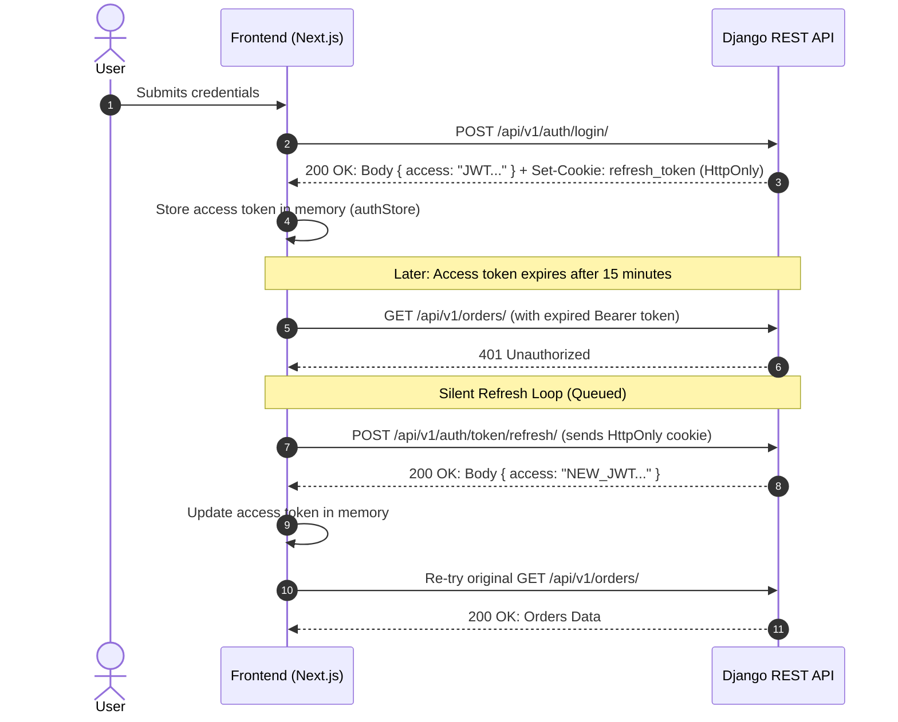
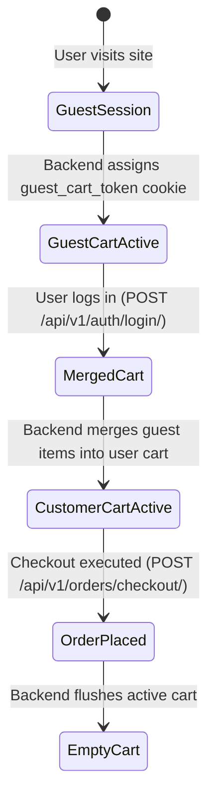
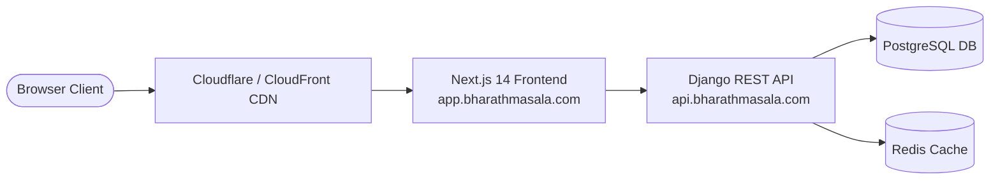

# Production Frontend Architecture: Bharath Masala

**Project:** Bharath Masala E-Commerce Platform  
**Target Backend:** Django REST Framework API (80 routes, 94 operations, OpenAPI 3.0.3 verified)  
**Document Purpose:** Architectural blueprint for a production-grade, decoupled, enterprise-scale frontend consuming the Bharath Masala backend.

---

## 1. Architectural Principles & Invariants

1. **Strict Decoupling:** The frontend is a completely isolated client application running in its own runtime environment (`frontend/`), interfacing with the Django backend exclusively over HTTP/REST APIs.
2. **Backend as the Single Source of Truth:**
   - Financial calculations (subtotals, GST tax splits, discounts, coupon validations) are **never duplicated** in frontend state. The frontend displays what the backend calculates.
   - Inventory availability, pack-size variant pricing, wholesale eligibility, and order status transitions are strictly backend-authoritative.
3. **Dynamic API Consumption:** Zero hardcoded mock products, categories, or pricing. All UI elements hydrate dynamically from live API responses.
4. **Resilient Failure Handling:** Built-in automatic token rotation, network retry logic, optimistic UI with rollback, and structured error propagation across all customer journeys.
5. **Preservation of Artisanal Brand Identity:** Maintain the high-craft luxury design language established in the design prototype (Playfair Display + Poppins typography, animated `.spice-trail` dividers, drifting particle embers, glassmorphism, and responsive micro-interactions).

---

## 2. Production Folder Structure

The project adopts a **Modular Feature-Driven Architecture** within the Next.js 14 App Router framework, structured inside `src/`:

```
frontend/
├── .env.example
├── .env.local
├── next.config.js
├── package.json
├── postcss.config.js
├── tailwind.config.js
├── tsconfig.json
├── public/
│   ├── images/              # Static brand assets, badges, terroir illustrations
│   └── favicon.ico
└── src/
    ├── api/                 # Centralized API layer (zero direct fetch calls in components)
    │   ├── client/          # Core HTTP transport & interceptors
    │   │   ├── httpClient.ts       # Axios/Fetch client with base URL & timeout
    │   │   ├── interceptors.ts     # JWT Bearer injection & 401 silent refresh loop
    │   │   └── envelope.ts         # Standardized { success, data, error, meta } parser
    │   ├── auth/            # Auth & address API definitions
    │   │   ├── authApi.ts          # login, register, registerWholesale, refresh, logout, getMe
    │   │   └── addressApi.ts       # listAddresses, createAddress, updateAddress, setDefault
    │   ├── catalog/         # Product, category & review APIs
    │   │   ├── categoryApi.ts      # listCategories, getCategoryDetail
    │   │   ├── productApi.ts       # listProducts, getProductDetail, getBestsellers
    │   │   └── reviewApi.ts        # listProductReviews, submitReview
    │   ├── cart/            # Shopping cart & coupon APIs
    │   │   ├── cartApi.ts          # getCart, addItem, updateItem, removeItem, clearCart
    │   │   └── couponApi.ts        # applyCoupon, removeCoupon
    │   ├── orders/          # Checkout, order lifecycle & invoice APIs
    │   │   ├── checkoutApi.ts      # executeCheckout, previewCheckout
    │   │   ├── orderApi.ts         # listOrders, getOrderDetail, cancelOrder
    │   │   └── invoiceApi.ts       # getInvoiceSummary, downloadInvoicePdf
    │   ├── payments/        # Razorpay initiation & verification APIs
    │   │   └── paymentApi.ts       # initiateRazorpayPayment, verifyPaymentSignature
    │   ├── shipping/        # Consignment & AWB tracking APIs
    │   │   └── shippingApi.ts      # getOrderTracking, trackPublicAwb
    │   └── returns/         # Customer RMA & reverse pickup APIs
    │       └── returnsApi.ts       # listReturns, createReturnRequest, cancelReturn
    │
    ├── components/          # Reusable UI component library
    │   ├── common/          # Atomic / Primitive design system components
    │   │   ├── Button/             # Golden pill (.btn-golden), primary, secondary, loading
    │   │   ├── Input/              # Form text inputs, floating labels, search bars
    │   │   ├── Select/             # Styled dropdowns, state selectors
    │   │   ├── Badge/              # Tier badge (Reserve/Everyday), stock status, B2B tag
    │   │   ├── Modal/              # Accessible dialogs, address modal, review modal
    │   │   ├── Drawer/             # Off-canvas slide-out sheet (Cart, Mobile Nav)
    │   │   ├── Toast/              # Alert notifications (success, warning, error)
    │   │   └── Skeleton/           # Skeleton loaders for cards, tables, details
    │   ├── layout/          # Application shell & framing
    │   │   ├── Header/             # Sticky glass navbar, search bar, cart & profile triggers
    │   │   ├── Footer/             # 4-column statutory footer, FSSAI/GST details, links
    │   │   ├── MobileNav/          # Mobile bottom navigation / hamburger drawer
    │   │   └── FloatingButtons/    # WhatsApp customer support & scroll-to-top button
    │   ├── products/        # Catalog & product display components
    │   │   ├── ProductCard/        # E-commerce card, pack-size selector, price display
    │   │   ├── ProductGrid/        # Responsive grid with empty & loading states
    │   │   ├── FilterBar/          # Category pills, tier filters, form filters, sorting
    │   │   ├── VariantSelector/    # Pack-size switcher (100g, 250g, 500g, 1kg)
    │   │   ├── ImageGallery/       # High-res image viewer with zoom & thumbnails
    │   │   └── ReviewList/         # Customer reviews, rating distribution, verified badges
    │   ├── cart/            # Shopping cart components
    │   │   ├── CartDrawer/         # Quick-view slide-over cart
    │   │   ├── CartItem/           # Line-item with pack size, price, quantity stepper
    │   │   ├── CouponInput/        # Coupon redemption field with discount feedback
    │   │   └── PriceSummary/       # Subtotal, discounts, estimated GST, payable total
    │   ├── checkout/        # Checkout flow components
    │   │   ├── AddressSelector/    # Saved address cards + "Add New Address" trigger
    │   │   ├── AddressForm/        # Indian address form (PIN code auto-fill, state choices)
    │   │   ├── OrderReview/        # Itemized snapshot with GST split (CGST+SGST / IGST)
    │   │   └── PaymentSection/     # Razorpay payment button & trust seals
    │   ├── orders/          # Post-order components
    │   │   ├── OrderTimeline/      # Step progress (PENDING -> CONFIRMED -> SHIPPED -> DELIVERED)
    │   │   ├── ShipmentTracker/    # Live AWB tracking & carrier checkpoint history
    │   │   └── ReturnRequestModal/ # 7-day RMA item selector & reason picker
    │   └── visual/          # Artisanal brand signatures
    │       ├── SpiceTrail/         # Dotted animated divider
    │       ├── EmberField/         # Drifting aroma particle canvas
    │       └── ReviewMarquee/      # Infinite horizontal customer testimonial track
    │
    ├── app/                 # Next.js 14 App Router (pages & server layouts)
    │   ├── layout.tsx              # Root layout, Google font injection, global providers
    │   ├── page.tsx                # Homepage (Hero, Featured Spices, Story, Reviews)
    │   ├── products/
    │   │   ├── page.tsx            # Full Catalog page with faceted filters
    │   │   └── [slug]/page.tsx     # Dynamic Product Detail Page (PDP)
    │   ├── cart/page.tsx           # Full Cart page (desktop & mobile)
    │   ├── checkout/page.tsx       # Protected 3-step checkout workflow
    │   ├── track/page.tsx          # Public AWB Tracking search portal
    │   ├── wholesale/page.tsx      # B2B Wholesale overview & application portal
    │   ├── (auth)/                 # Authentication route group
    │   │   ├── login/page.tsx
    │   │   ├── register/page.tsx
    │   │   └── register-wholesale/page.tsx
    │   └── account/                # Protected Customer Portal
    │       ├── layout.tsx          # Sidebar layout (Profile, Orders, Addresses)
    │       ├── page.tsx            # Account overview & wholesale status badge
    │       ├── orders/
    │       │   ├── page.tsx        # Order history list
    │       │   └── [id]/page.tsx   # Order detail, tracking, invoice download, RMA
    │       └── addresses/page.tsx  # Address book manager
    │
    ├── hooks/               # Custom React hooks
    │   ├── useAuth.ts              # Current user profile, tokens, login/logout actions
    │   ├── useCart.ts              # Cart line items, totals, add/update/remove mutations
    │   ├── useCatalog.ts           # Product list querying, pagination, search debounce
    │   ├── useRazorpay.ts          # Razorpay script loading & modal launcher
    │   ├── useDebounce.ts          # Search input debouncing
    │   └── useReveal.ts            # IntersectionObserver scroll animation hook
    │
    ├── services/            # Business orchestration (non-component business logic)
    │   ├── authService.ts          # Token storage, persona checks (retail vs wholesale)
    │   ├── cartService.ts          # Guest token management, optimistic sync
    │   └── paymentService.ts       # Razorpay order checkout orchestration
    │
    ├── store/               # Lightweight client state stores (Zustand)
    │   ├── authStore.ts            # User identity, access token, wholesale status
    │   ├── cartStore.ts            # Cart UI state (drawer open/close, optimistic items)
    │   └── uiStore.ts              # Global toasts, search modal, mobile nav state
    │
    ├── types/               # TypeScript contracts matching OpenAPI 3.0 schema
    │   ├── auth.types.ts           # User, Address, LoginCredentials, WholesaleApplication
    │   ├── catalog.types.ts        # Category, Product, ProductVariant, Review, Tier, Form
    │   ├── cart.types.ts           # Cart, CartItem, AppliedCoupon
    │   ├── order.types.ts          # Order, OrderItem, OrderStatus, AddressSnapshot, GSTBreakdown
    │   ├── payment.types.ts        # Payment, RazorpayOptions, PaymentVerification
    │   ├── shipping.types.ts       # Shipment, TrackingCheckpoint, Carrier
    │   └── api.types.ts            # ApiResponse<T>, ApiError, PaginationMeta
    │
    ├── utils/               # Pure utility functions
    │   ├── formatters.ts           # Currency (₹ INR), date (DD MMM YYYY), pack-size (250g)
    │   ├── validators.ts           # Indian PIN code, GSTIN, PAN, Phone number validators
    │   └── storage.ts              # Safe localStorage / sessionStorage wrappers
    │
    └── constants/           # Platform constants
        ├── config.ts               # App metadata, support phone, email, FSSAI number
        ├── endpoints.ts            # Strict backend route mappings
        └── routes.ts               # Internal frontend route paths
```

---

## 3. API Layer Architecture

### 3.1 Transport & HTTP Client (`src/api/client/httpClient.ts`)
- Configured with `NEXT_PUBLIC_API_URL` (default `http://127.0.0.1:8000`).
- Global request timeout set to `15,000ms`.
- Automatically sends `withCredentials: true` so the browser transmits the `refresh_token` and `guest_cart_token` HttpOnly cookies.

```typescript
// Architectural Flow of HTTP Client
[ Component / Hook ]
        |
        v
[ Domain API Service (e.g. cartApi.addItem) ]
        |
        v
[ Request Interceptor ]
  - Injects 'Authorization: Bearer <accessToken>' (if logged in)
  - Injects 'X-CSRFToken' (from cookie if present)
  - Injects 'Content-Type: application/json'
        |
        v
[ Django REST API Endpoint ]
        |
        v
[ Response Interceptor ]
  - Case 2xx: Unwraps standard Django envelope -> returns response.data
  - Case 401: Intercepts unauthenticated error -> triggers Silent Refresh Lock
  - Case 4xx/5xx: Formats standardized ApiError -> throws to calling hook
```

### 3.2 Standardized Response Envelope Parser
The Django backend wraps API responses in a unified structure:
```json
{
  "success": true,
  "data": { ... },
  "meta": { "timestamp": "...", "version": "1.0" },
  "error": null
}
```
The API client unwraps `response.data.data` automatically. In case of error, it parses:
```json
{
  "success": false,
  "data": null,
  "error": {
    "code": "INSUFFICIENT_STOCK",
    "message": "Only 3 units available for Salem Turmeric 250g.",
    "details": { "available_quantity": 3 }
  }
}
```

### 3.3 Domain Services Mapping (100% Backend Matched)

| Domain | Frontend Service | Django REST API Route | Description |
| :--- | :--- | :--- | :--- |
| **Auth** | `authApi.login` | `POST /api/v1/auth/login/` | Authenticates user; returns access token. |
| | `authApi.refresh` | `POST /api/v1/auth/token/refresh/` | Rotates access token via HttpOnly cookie. |
| | `authApi.registerRetail` | `POST /api/v1/auth/register/` | Customer self-registration. |
| | `authApi.registerWholesale` | `POST /api/v1/auth/register/wholesale/` | B2B registration with GSTIN & PAN. |
| | `authApi.getMe` | `GET /api/v1/auth/me/` | User profile & wholesale approval state. |
| **Address** | `addressApi.list` | `GET /api/v1/auth/addresses/` | Customer saved address book. |
| | `addressApi.create` | `POST /api/v1/auth/addresses/` | Add address with Indian state choice. |
| | `addressApi.setDefault` | `POST /api/v1/auth/addresses/{id}/set-default/` | Designate primary shipping address. |
| **Catalog** | `catalogApi.listCategories` | `GET /api/v1/catalog/categories/` | Category hierarchy. |
| | `catalogApi.listProducts` | `GET /api/v1/catalog/products/` | Products with filtering, search, sort. |
| | `catalogApi.getProduct` | `GET /api/v1/catalog/products/{slug}/` | Product master, variants, terroir story. |
| | `catalogApi.listReviews` | `GET /api/v1/catalog/products/{slug}/reviews/` | Verified customer reviews. |
| **Cart** | `cartApi.getCart` | `GET /api/v1/cart/` | Fetch current customer/guest cart. |
| | `cartApi.addItem` | `POST /api/v1/cart/items/` | Add variant (`variant_id`, `quantity`). |
| | `cartApi.updateItem` | `PATCH /api/v1/cart/items/{id}/` | Update quantity. |
| | `cartApi.removeItem` | `DELETE /api/v1/cart/items/{id}/` | Delete line item. |
| | `cartApi.applyCoupon` | `POST /api/v1/cart/coupon/` | Redeem promotional coupon code. |
| **Orders** | `orderApi.checkout` | `POST /api/v1/orders/checkout/` | Atomic checkout (creates PENDING order). |
| | `orderApi.list` | `GET /api/v1/orders/` | Order history list. |
| | `orderApi.getDetail` | `GET /api/v1/orders/{id}/` | Item snapshots, GST breakdown, status. |
| | `orderApi.cancel` | `POST /api/v1/orders/{id}/cancel/` | Cancel order before shipment dispatch. |
| | `orderApi.downloadInvoice` | `GET /api/v1/orders/{id}/invoice/download/` | Statutory GST Tax Invoice PDF. |
| **Payments** | `paymentApi.initiate` | `POST /api/v1/payments/orders/{id}/initiate/` | Create Razorpay order & fetch key. |
| | `paymentApi.verify` | `POST /api/v1/payments/orders/{id}/verify/` | Verify signature & confirm order. |
| **Shipping** | `shippingApi.getOrderTracking` | `GET /api/v1/shipping/orders/{id}/tracking/` | Consignment tracking for customer order. |
| | `shippingApi.trackAwb` | `GET /api/v1/shipping/track/?awb={awb}` | Public AWB parcel tracking. |
| **Returns** | `returnsApi.list` | `GET /api/v1/orders/{id}/returns/` | Active return requests for order. |
| | `returnsApi.create` | `POST /api/v1/orders/{id}/returns/` | Submit RMA within 7-day window. |

---

## 4. Authentication Strategy

### 4.1 Token Lifecycle & Security
Bharath Masala employs a **Dual-Token Architecture**:
- **Access Token:** Short-lived JWT (15-minute expiration). Stored strictly **in-memory** in the `authStore` (never stored in `localStorage` to prevent XSS exfiltration).
- **Refresh Token:** Long-lived JWT (7-day expiration). Managed exclusively by the browser via an **HttpOnly, Secure, SameSite=Lax cookie** (`refresh_token` mapped to `/api/v1/auth/`).



### 4.2 Mutex-Locked Silent Refresh Queue
When multiple parallel API calls encounter a `401 Unauthorized` simultaneously, sending multiple concurrent refresh requests would invalidate rotating refresh tokens. 
The HTTP interceptor implements a **Subscriber Queue with Mutex Lock**:
1. The first 401 sets `isRefreshing = true` and triggers a single call to `POST /api/v1/auth/token/refresh/`.
2. Subsequent failed requests are pushed into a `failedQueue` array awaiting resolution.
3. Upon refresh success, all queued requests are executed with the new access token.
4. If the refresh request itself fails (e.g. cookie expired), the queue is rejected, the user is marked logged out, and redirected to `/login?session_expired=1`.

### 4.3 Customer Personas & Route Guarding
The application recognizes three distinct consumer personas:
1. **Anonymous Guest:** Can browse catalog, read reviews, add items to guest cart, track public AWBs.
2. **Retail Customer:** Verified user with shopping cart, address book, personal order history, and RMA rights.
3. **B2B Wholesale Customer:** Verified business entity with access to wholesale tier pricing, bulk pack sizes, and GST tax credit invoices.
   - **Verification States:** `PENDING` (displays review banner), `VERIFIED` (unlocks wholesale prices), `REJECTED` (shows rejection rationale).

---

## 5. Cart Synchronization Strategy

The shopping cart is **100% backend-authoritative**. The frontend maintains zero offline price recalculation.



### 5.1 Dual-Mode Operation
- **Guest Mode:**
  - When an anonymous user loads the site or adds an item, requests pass credentials.
  - The Django backend issues and validates the `guest_cart_token` cookie.
  - All line items, volume tiers, and subtotal amounts reflect the guest cart session.
- **Customer Mode:**
  - Upon user login, the Django backend automatically **merges** the guest cart items into the user's permanent cart.
  - The frontend triggers an immediate `GET /api/v1/cart/` re-fetch to update the UI drawer.

### 5.2 Optimistic Updates with Rollback
- To deliver instantaneous feedback, clicking `+` or `-` on a cart item updates the local display counter immediately.
- The mutation call (`PATCH /api/v1/cart/items/{id}/`) runs in the background.
- If the backend returns `409 Conflict` (e.g. *Inventory stock exhausted*), the frontend reverts the quantity and presents an explanatory toast alert.

---

## 6. Error Handling Strategy

Errors are categorized and handled systematically based on HTTP status codes and backend error codes:

| HTTP Status | Error Type | UI Presentation & Recovery Strategy |
| :--- | :--- | :--- |
| **`400 Bad Request`** | Form / Validation Error | Render inline field-level validation errors beneath specific inputs (e.g., "Invalid 6-digit PIN code", "Invalid GSTIN format"). |
| **`401 Unauthorized`** | Expired / Missing Token | Silent refresh loop intercepts. If refresh fails, store current location in `?next=...` and redirect to `/login`. |
| **`403 Forbidden`** | Permission Denied | Display tailored permission notice (e.g. "Wholesale account pending verification — wholesale orders are unlocked once staff approves your GSTIN"). |
| **`404 Not Found`** | Missing Resource | Display clean in-page empty state (e.g., "Product not found or discontinued", "No orders placed yet"). |
| **`409 Conflict`** | Concurrency / Business Conflict | Trigger warning modal or toast: *Stock reserved by another user*, *Order already dispatched and cannot be cancelled*, or *Coupon minimum spend not reached*. Re-fetch cart/order. |
| **`429 Too Many Requests`** | Rate Limiting | Display gentle countdown toast: "Too many requests. Please wait a few seconds before trying again." |
| **`500 / Network Drop`** | Server / Connectivity | Non-blocking global toast with a "Retry" action button. Never crash the React tree (handled by React Error Boundaries). |

---

## 7. Loading State Strategy

A premium e-commerce experience requires fluid, layout-stable transitions without cumulative layout shift (CLS):

1. **Page-Level Transitions (Streaming with Suspense):**
   - Catalog and PDP routes leverage Next.js App Router `loading.tsx` and `<Suspense>` boundaries.
   - Initial server response delivers immediate layout shells while product grids hydrate asynchronously.
2. **Skeleton Screens (Component Level):**
   - `ProductCardSkeleton`: Emulates the 4-column card grid with pulsing placeholder imagery, title bar, and button pill.
   - `OrderDetailSkeleton`: Renders placeholder progress timeline, shipping address card, and table rows.
3. **Action-Level Micro-Loaders:**
   - Buttons enter a loading state during mutations (e.g. "Adding to Cart...", "Applying Coupon...", "Initiating Payment...").
   - Disables button interaction to prevent double-submission or race conditions.
4. **Optimistic State Indicators:**
   - Favor instant UI feedback for cart count badges and wishlists, with silent network reconciliation.

---

## 8. Responsive Design Strategy

The platform is designed **Mobile-First**, engineered for high-conversion shopping on mobile devices while expanding gracefully to desktop displays:

| Breakpoint | Target Devices | Key Layout Adaptations |
| :--- | :--- | :--- |
| **`< 640px` (Mobile)** | Smartphones | - Fixed bottom checkout / add-to-cart bar for thumb-zone reachability.<br>- Cart opens as a full-screen or bottom slide-over sheet.<br>- Product grid displays 2 items per row with condensed packaging details.<br>- Touch targets minimum $44 \times 44\text{px}$. |
| **`640px – 1023px` (Tablet)** | iPads, Tablets | - 3-column product catalog.<br>- Cart renders as a 400px slide-out right drawer.<br>- Category pills display in an overflow horizontal scroll container with hidden scrollbars. |
| **`≥ 1024px` (Desktop)** | Laptops, Desktops | - 4-column product grid with hover-elevation effects (`.dish-card:hover`).<br>- Multi-column checkout (Shipping & Payment Left, Order Summary & GST Right).<br>- Full sticky header with search dropdown and account mega-menu. |

---

## 9. Environment Variable Strategy

Strict separation between build-time public variables and runtime secrets:

### 9.1 Variable Definitions

```bash
# ---------------------------------------------------------------------------
# Bharath Masala Frontend Environment Configuration
# ---------------------------------------------------------------------------

# Public Backend REST API Base URL
NEXT_PUBLIC_API_URL="http://127.0.0.1:8000"

# Razorpay Client-Side Key ID (Public key for checkout modal)
NEXT_PUBLIC_RAZORPAY_KEY_ID="rzp_test_YourKeyIdHere"

# Static Asset & CDN URL (if served from external cloud bucket)
NEXT_PUBLIC_ASSET_URL=""

# Customer Support WhatsApp Number
NEXT_PUBLIC_WHATSAPP_SUPPORT="919876543210"

# Google Analytics / Telemetry ID (Optional)
NEXT_PUBLIC_GA_MEASUREMENT_ID=""
```

### 9.2 Runtime Environment Matrix

| Environment | `NEXT_PUBLIC_API_URL` | Cookie Domain | Razorpay Mode |
| :--- | :--- | :--- | :--- |
| **Local Development** | `http://127.0.0.1:8000` | `localhost` | Test Mode |
| **Staging / QA** | `https://staging-api.bharathmasala.com` | `.bharathmasala.com` | Test Mode |
| **Production** | `https://api.bharathmasala.com` | `.bharathmasala.com` | Live Mode |

---

## 10. Production Deployment Strategy



### 10.1 Domain & Cookie Architecture
To ensure seamless authentication without third-party cookie restrictions in modern browsers (Safari ITP, Chrome Privacy Sandbox):
- **Frontend Domain:** `app.bharathmasala.com` (or `www.bharathmasala.com`)
- **Backend API Domain:** `api.bharathmasala.com`
- **Cookie Scope:** Both services share the parent domain `.bharathmasala.com` with `SameSite=Lax` and `Secure=True`.
- This architecture enables the browser to transmit the `refresh_token` and `guest_cart_token` cookies securely during cross-origin API calls without CORS blocking.

### 10.2 Caching & Rendering Balance
- **Static Site Generation (SSG) with ISR:**
  - Homepage (`/`) and Static Policy pages revalidated every 10 minutes (`revalidate: 600`).
  - Product Detail Pages (`/products/[slug]`) statically pre-rendered for top products and revalidated on demand or via short TTL (`revalidate: 60`).
- **Client-Side Rendering (CSR):**
  - Checkout (`/checkout`), Account Dashboard (`/account/*`), Order Tracking (`/orders/[id]`), and Returns (`/orders/[id]/returns`) render dynamically on the client for real-time security and data freshness.

---

## 11. Architecture Verification & Readiness Checklist

- [x] **Zero Backend Modification:** Architecture interfaces strictly with the existing 80 Django routes.
- [x] **No Business Logic Duplication:** All GST, pricing, discounts, and inventory rules stay in Django.
- [x] **Token Isolation:** Access token held in memory; refresh token secured in HttpOnly cookie.
- [x] **Unified Error Propagation:** Standardized handling for 400, 401, 403, 404, 409, 429, 500.
- [x] **State Separation:** Clear division between server cache, client session, cart sync, and UI states.
- [x] **Brand Heritage Preservation:** Visual language reflects Western Ghats artisanal terroir with modern polish.

**Document Status:** Complete & Ready for Step-by-Step Implementation.
