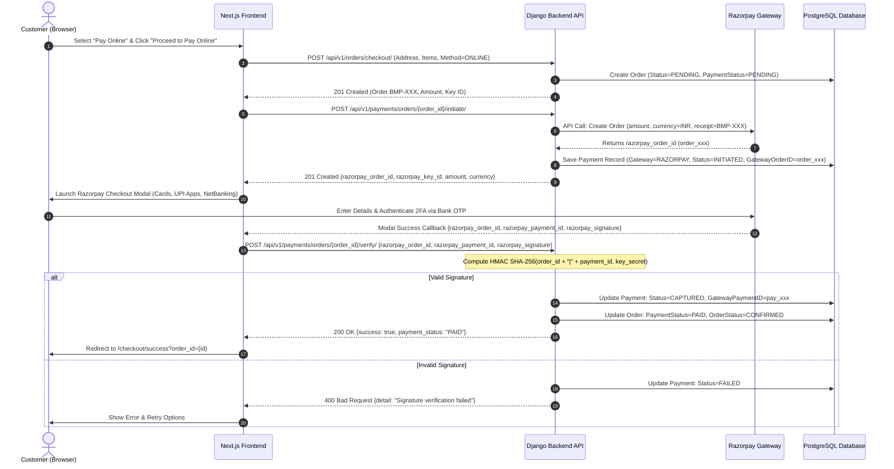
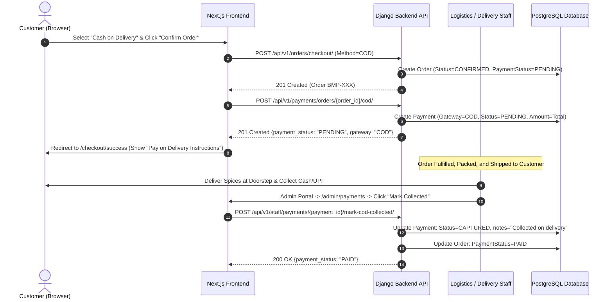

# Bharat Masala — Payment Architecture & Security Specification

**Document:** `PAYMENT_ARCHITECTURE.md`  
**Date:** September 8, 2026  
**System:** Bharat Masala Full-Stack E-Commerce Platform  
**Authors:** Senior Full-Stack Architect & Core Infrastructure Team  

---

## 1. Architectural Overview

Bharat Masala implements a resilient, dual-track payment processing architecture supporting:
1. **Online Payments (Razorpay Payment Gateway):** Direct checkout via UPI, NetBanking, Credit/Debit Cards, and Wallets using client-side checkout modal with cryptographic HMAC SHA-256 backend verification and asynchronous webhook reconciliation.
2. **Cash on Delivery (COD):** Offline deferred payment mode where customer checkout creates an order in a pending fulfillment state, and warehouse/delivery staff confirm physical collection upon doorstep delivery.

### Key Architectural Tenets:
- **Zero Cardholder Data Direct Ingestion:** Bharat Masala servers never handle, store, or transmit raw card numbers, CVVs, PINs, or bank OTPs. All sensitive instrument handling is delegated to Razorpay's PCI-DSS Level 1 certified checkout iframe.
- **No Mock or Simulated Success:** Frontends never mark an order as `PAID` based on client-side state. Every successful payment requires atomic backend cryptographic verification or signed webhook verification.
- **Idempotency & Deduplication:** Webhooks and verification endpoints verify and deduplicate payment events to eliminate race conditions, double captures, or replayed webhooks.
- **Auditable Lifecycle:** All state transitions (`INITIATED` -> `CAPTURED` / `FAILED` / `REFUNDED`) are recorded in an immutable ledger in the database with timestamps, gateway references, and user/staff metadata.

---

## 2. End-to-End Payment Flows

### 2.1 Online Payment Flow (Razorpay Gateway)



---

### 2.2 Cash on Delivery (COD) Flow



---

## 3. Cryptographic Signature Verification & Webhooks

### 3.1 Razorpay Signature Algorithm
When Razorpay Checkout succeeds in the client's browser, it returns:
- `razorpay_order_id`
- `razorpay_payment_id`
- `razorpay_signature`

The backend verifies this payload using HMAC-SHA256:
$$\text{Signature} = \text{HMAC-SHA256}(\text{razorpay\_order\_id} + "|" + \text{razorpay\_payment\_id}, \text{RAZORPAY\_KEY\_SECRET})$$

```python
# apps/payments/services/payment_service.py
payload = f"{razorpay_order_id}|{razorpay_payment_id}"
generated_signature = hmac.new(
    settings.RAZORPAY_KEY_SECRET.encode("utf-8"),
    payload.encode("utf-8"),
    hashlib.sha256
).hexdigest()

if not hmac.compare_digest(generated_signature, razorpay_signature):
    raise SignatureVerificationError("Payment signature verification failed.")
```
`hmac.compare_digest` prevents timing attacks.

### 3.2 Asynchronous Webhook Architecture
In scenarios where a customer closes their browser after authenticating the payment but before the frontend can call `/verify/`, Razorpay's webhook delivers guaranteed state synchronization:
- **Webhook Endpoint:** `POST /api/v1/payments/webhooks/razorpay/`
- **Signature Header:** `X-Razorpay-Signature`
- **Verification:**
  $$\text{Webhook Signature} = \text{HMAC-SHA256}(\text{Raw Request Body}, \text{RAZORPAY\_WEBHOOK\_SECRET})$$
- **Idempotency Deduplication:** The event ID (`event["id"]`) is cached in Redis / checked against processed events. If already handled, the webhook service returns HTTP `200 OK` immediately without duplicate side-effects.
- **Handled Events:**
  - `payment.captured`: Confirms payment and upgrades order status to `CONFIRMED`.
  - `payment.failed`: Records payment failure and informs order management.
  - `refund.processed`: Tracks refunds and logs credit note identifiers.

---

## 4. Payment States & Reconciliation Matrix

### 4.1 Payment Model Statuses (`PaymentStatus`)
| Status | Meaning | Applicable Gateways | Transitions To |
| :--- | :--- | :--- | :--- |
| `INITIATED` | Order token created with Razorpay API; customer modal active | Razorpay | `CAPTURED`, `FAILED` |
| `PENDING` | Payment awaited upon delivery or pending manual verification | COD, Legacy UPI | `CAPTURED`, `FAILED` |
| `CAPTURED` | Payment successfully verified, settled, or collected physically | Razorpay, COD, Legacy UPI | `REFUNDED` |
| `FAILED` | Transaction declined by issuing bank, timed out, or signature mismatch | Razorpay, Legacy UPI | End state |
| `REFUNDED` | Funds reversed to original payment instrument | Razorpay | End state |

### 4.2 Order Payment Statuses (`Order.payment_status`)
- `PENDING`: Payment has not yet been secured (standard for newly placed COD and unverified online orders).
- `PAID`: Payment has been cryptographically verified or confirmed by operations staff.
- `FAILED`: Payment attempt failed.
- `REFUNDED`: Entire order value has been refunded.

---

## 5. Security Architecture & Threat Modeling

1. **Direct Card / Instrument Protection (PCI-DSS Compliance):**
   - No payment instrument fields exist in HTML forms, database tables, or Django models.
   - All payment forms render inside the isolated Razorpay Checkout SDK iframe hosted at `https://checkout.razorpay.com`.
2. **Anti-IDOR (Insecure Direct Object Reference) Protection:**
   - Customers can only initiate, verify, or view payments for orders they own (`order.user == request.user`).
   - Order IDs are verified against session tokens.
3. **Price & Amount Tampering Protection:**
   - Order amount is calculated exclusively on the backend from line items, quantity, live variant pricing, shipping rules, and applied coupon discounts.
   - The frontend cannot submit a custom payment amount; the payment gateway order is created with the backend-computed `total_amount_inr * 100` (paise).
4. **Secret Key Safeguards:**
   - `RAZORPAY_KEY_SECRET` and `RAZORPAY_WEBHOOK_SECRET` are never exposed to the frontend or bundled in client JS.
   - Frontend only accesses the public `RAZORPAY_KEY_ID` via `process.env.NEXT_PUBLIC_RAZORPAY_KEY_ID`.
5. **Staff Access Controls:**
   - The endpoint `POST /api/v1/staff/payments/{id}/mark-cod-collected/` is strictly guarded by `IsAuthenticated` and `IsStaffUser` permissions. Regular customers receive HTTP `403 Forbidden`.
