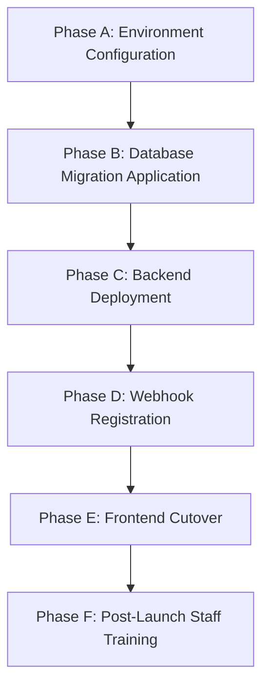

# Bharat Masala — Payment Migration & Modernization Plan

**Document:** `PAYMENT_MIGRATION_PLAN.md`  
**Date:** September 8, 2026  
**System:** Bharat Masala Full-Stack E-Commerce Platform  
**Target State:** Zero Manual Customer Friction, Automated Razorpay Gateway & COD Integration  

---

## 1. Executive Migration Context

Prior to this engineering modernization, Bharat Masala relied on an informal, high-friction manual payment procedure:
- **Legacy Approach:** Customers were presented with a static QR code image, an exposed merchant UPI VPA (`7892823912-9@axl`), an instruction to open external banking apps, manually transfer funds, copy a 12-digit UTR (Unique Transaction Reference) number, and paste it back or upload a screenshot receipt into the web app.
- **Operational Deficiencies:** High checkout abandonment, extreme friction on mobile browsers, zero real-time verification, vulnerability to fabricated UTR submissions, manual staff overhead to inspect bank statements, and delayed order dispatch.
- **Modernized Target:** Professional e-commerce standard with Razorpay Gateway (instant UPI intent, Cards, NetBanking with cryptographic HMAC signature verification) and Cash on Delivery (COD), while preserving 100% of historical transaction audit trails.

---

## 2. Comparison: Old System vs. New Modernized Architecture

| Dimension | Legacy Manual QR / UTR System | Modernized Gateway & COD Architecture |
| :--- | :--- | :--- |
| **Customer Interaction** | Static QR graphic, exposed UPI ID, manual UTR input | Native Razorpay Checkout modal or 1-Click COD confirmation |
| **Payment Verification** | Manual staff inspection of bank statements | Backend cryptographic HMAC-SHA256 signature verification |
| **Checkout Latency** | Minutes (switching apps, copying UTR) | < 15 seconds (seamless UPI intent / cards / COD) |
| **Confirmation Speed** | Delayed hours/days until staff review | Instantaneous (< 500ms post-authentication) |
| **Fraud Vulnerability** | High (forged 12-digit UTR numbers, fake screenshots) | Zero (bank-authenticated cryptographic tokens) |
| **Dispute & Refund** | Manual bank IMPS/NEFT transfers | Integrated programmatic gateway refunds with audit IDs |
| **Offline Cash Support** | None (forced manual UPI) | Structured Cash on Delivery with staff collection verification |

---

## 3. Database Schema Evolution & Backward Compatibility

### 3.1 `apps/payments/models.py` Evolution
To maintain data integrity and avoid breaking historical reporting, no tables, columns, or legacy rows were deleted:
- **`PaymentGateway` TextChoices:**
  ```python
  class PaymentGateway(models.TextChoices):
      RAZORPAY = "RAZORPAY", _("Razorpay")
      MANUAL_UPI = "MANUAL_UPI", _("Manual UPI QR")  # Preserved for historical orders
      COD = "COD", _("Cash on Delivery")              # Added in Migration 0005
  ```
- **Migration Applied:** `0005_alter_payment_gateway.py` safely adds `'COD'` to valid choices without altering existing records or locking tables.
- **Historical Orders Safety:** Existing orders referencing `MANUAL_UPI` remain untouched and viewable in the admin console. The admin interface includes a designated "Legacy UPI QR" filter tab and screenshot proof viewer modal specifically to audit pre-migration orders.

---

## 4. Deprecated Code & API Deprecation Policy

### 4.1 Frontend Deprecations
1. **Removed UI Artifacts:**
   - Deleted static UPI QR code displays from `PaymentModal.jsx`.
   - Removed copy-to-clipboard button and exposed UPI VPA text.
   - Removed UTR 12-digit input textfield and screenshot file uploader from customer checkout.
2. **`frontend/services/paymentService.js`:**
   - Added `@deprecated` annotation to `submitUTR()`. The function remains stubbed for backward compatibility but is no longer called anywhere in the customer-facing interface.
   - Added active methods: `createCODPayment(orderId)` and `markCODCollected(paymentId)`.

### 4.2 Backend API Backward Compatibility
- **`POST /api/v1/payments/orders/{id}/submit-utr/`:**
  Maintained for API contract stability. If invoked, it enforces strict format validation (`^[0-9]{12}$`) and logs a deprecation warning (`apps.payments.services.payment_service: Deprecated manual UTR submission received for order ...`).
- **New Customer Endpoints:**
  - `POST /api/v1/payments/orders/{id}/initiate/`: Initiates Razorpay order.
  - `POST /api/v1/payments/orders/{id}/verify/`: Validates HMAC signature.
  - `POST /api/v1/payments/orders/{id}/cod/`: Instantiates Cash on Delivery payment.
- **New Staff Endpoints:**
  - `POST /api/v1/staff/payments/{id}/mark-cod-collected/`: Authenticated staff confirmation of physical cash receipt.

---

## 5. Phased Production Rollout & Cutover Checklist



### Phase A: Environment Variable Provisioning
Ensure the following variables are configured in production secrets manager:
```bash
# Razorpay Credentials
RAZORPAY_KEY_ID="rzp_live_xxxxxxxxxxxxxx"
RAZORPAY_KEY_SECRET="xxxxxxxxxxxxxxxxxxxxxxxx"
RAZORPAY_WEBHOOK_SECRET="whsec_xxxxxxxxxxxxxxxxxxxxxxxx"
NEXT_PUBLIC_RAZORPAY_KEY_ID="rzp_live_xxxxxxxxxxxxxx"
```

### Phase B: Database Migrations
Execute on the application server:
```bash
python manage.py migrate apps.payments
```
*Expected output: `Applying payments.0005_alter_payment_gateway... OK`*

### Phase C: Backend Deployment
Restart Django application workers (Gunicorn/Uvicorn) and Celery workers to load new gateway service routes.

### Phase D: Razorpay Dashboard Webhook Configuration
1. Log in to [Razorpay Dashboard](https://dashboard.razorpay.com/) $\rightarrow$ Settings $\rightarrow$ Webhooks.
2. Add Webhook URL: `https://api.bharatmasala.com/api/v1/payments/webhooks/razorpay/`.
3. Secret: Enter value matching `RAZORPAY_WEBHOOK_SECRET`.
4. Active Events: Select `payment.captured`, `payment.failed`, and `refund.processed`.

### Phase E: Frontend Deployment
Deploy Next.js build. Customer checkout immediately switches to "Pay Online" (Razorpay) and "Cash on Delivery". No customers will see QR codes or UTR fields.

### Phase F: Rollback Contingency Strategy
In the unlikely event of a critical upstream payment gateway disruption:
1. Customers can immediately choose **Cash on Delivery (COD)**, preventing sales interruption.
2. If online payment gateway needs temporary deactivation, set `RAZORPAY_ENABLED=False` in environment settings to gracefully hide the online option and default exclusively to COD.
3. No database rollback is required because `0005_alter_payment_gateway` is purely additive.
