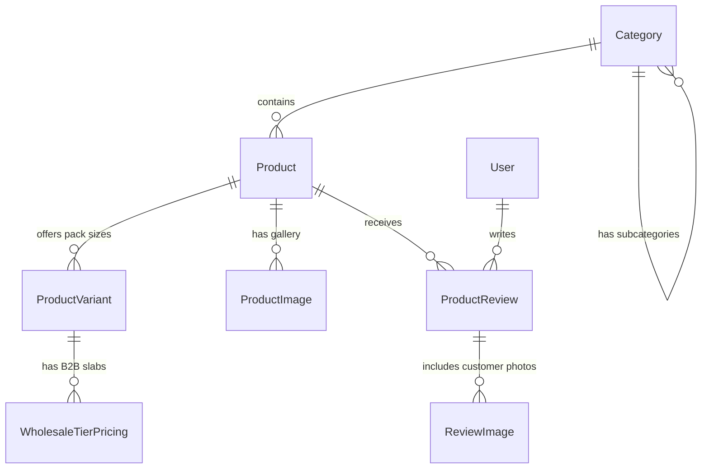

# PHASE 2 PRE-IMPLEMENTATION AUDIT: CATALOG DOMAIN
**Platform**: Bharath Masala Products E-Commerce Backend  
**Audit Target**: Pre-Implementation Validation of Phase 1 Compatibility & Phase 2 Architecture  
**Date**: September 4, 2026  
**Status**: AUDIT COMPLETE — AWAITING IMPLEMENTATION AUTHORIZATION  

---

## 1. Existing Phase 1 Compatibility Result

Phase 1 code, models, middlewares, and services were thoroughly audited. No regressions or structural incompatibilities were found:
- **`apps.core.models.TimeStampedModel`**: Provides standard `created_at` (db-indexed) and `updated_at` timestamps, directly inherited by all Phase 2 catalog models.
- **`apps.core.renderers.StandardResponseRenderer`**: Fully compatible with Phase 2 single-object and paginated responses, enforcing `{ success, request_id, message, data, error }` with clean 204 support.
- **`apps.core.exceptions.custom_exception_handler`**: Captures DRF and Django validation errors, `NotFound` (404 for invalid product slugs), and `PermissionDenied` (403 for unauthorized wholesale operations).
- **`apps.core.pagination.StandardResultsSetPagination`**: Implements safe bounded pagination (`page_size = 20`, `max_page_size = 100`) with results metadata. Directly reusable across all catalog listing and review listing views.
- **`apps.accounts.models.User` & `WholesaleProfile`**: The existing `user.is_wholesale_buyer` property and `Role.WHOLESALE_APPROVED` state machine are directly leveraged by Phase 2 catalog serializers and permissions to control slab pricing visibility.

---

## 2. Existing Test Result

- **Command**: `python3 manage.py test`
- **Total Tests**: 42
- **Passed**: 42
- **Failed**: 0
- **Errors**: 0
- **Execution Time**: 8.621s
- **Status**: **PASS (100% passing)**

---

## 3. Django System Check Result

- **Command**: `python3 manage.py check`
- **Output**: `System check identified no issues (0 silenced).`
- **Production Deployment Check**: `python3 manage.py check --deploy` (with production settings)
- **Output**: `System check identified no issues (0 silenced).`

---

## 4. Migration Check Result

- **Command**: `python3 manage.py makemigrations --check --dry-run`
- **Output**: `No changes detected`
- **Migration Graph**: Clean dependency chain (`contenttypes` → `auth` → `accounts` → `admin` → `sessions` → `token_blacklist`). All 0001 migrations applied.

---

## 5. Dependency Compatibility Result

- **Django**: `5.0.6` (Compatible with PostgreSQL 15+, conditional constraints, and modern model fields).
- **Django REST Framework**: `3.16.0` (Compatible with custom pagination, renderers, serializers, and permissions).
- **Pillow**: `11.1.0` (Pre-installed in environment; handles image uploads, MIME type inspection, EXIF stripping, and thumbnailing). Added explicitly to `requirements.txt`.
- **Database Driver**: `psycopg2-binary 2.9.12` (Production PostgreSQL connection pooling and JSON operations).

---

## 6. Proposed Phase 2 Database Schema

The catalog models will reside in `apps/catalog/models.py`:



### A. `Category` (`apps.catalog.models.Category`)
- `id`: `UUIDField` (primary key, default `uuid.uuid4`, editable=False)
- `name`: `CharField(max_length=120, db_index=True)`
- `slug`: `SlugField(max_length=140, unique=True, db_index=True)`
- `parent`: `ForeignKey('self', on_delete=models.CASCADE, null=True, blank=True, related_name='subcategories')`
- `description`: `TextField(blank=True, default='')`
- `sort_order`: `PositiveIntegerField(default=0, db_index=True)`
- `is_active`: `BooleanField(default=True, db_index=True)`
- Timestamps: `created_at`, `updated_at` (via `TimeStampedModel`)

### B. `Product` (`apps.catalog.models.Product`)
- `id`: `UUIDField` (primary key, default `uuid.uuid4`, editable=False)
- `name`: `CharField(max_length=200, db_index=True)`
- `slug`: `SlugField(max_length=220, unique=True, db_index=True)`
- `category`: `ForeignKey(Category, on_delete=models.PROTECT, related_name='products')`
- `tier`: `CharField(max_length=20, choices=Tier.choices, db_index=True)` (`RESERVE`, `EVERYDAY`)
- `form`: `CharField(max_length=20, choices=Form.choices, db_index=True)` (`WHOLE`, `GROUND`, `BLEND`, `RAW`)
- `short_description`: `CharField(max_length=300, blank=True, default='')`
- `detailed_description`: `TextField(blank=True, default='')`
- `origin_region`: `CharField(max_length=150, db_index=True)` (e.g., *"Malenadu"*, *"Karnataka-Konkan"*, *"Kashmir"*, *"Nashik"*, *"Ladakh"*, *"Imported"*)
- `plantation_provenance`: `TextField(blank=True, default='')` (Authentic Malenadu family plantation heritage)
- `origin_stamp`: `CharField(max_length=200, default="Grown in Malenadu · Uttara Kannada")`
- `grade`: `CharField(max_length=100, blank=True, default='')` (e.g., *"Bold Extra Fancy"*, *"Single-Estate Handpicked"*)
- `harvest_date`: `DateField(null=True, blank=True)`
- `grinding_date`: `DateField(null=True, blank=True)`
- `sharada_note`: `TextField(blank=True, default='')` (Spoken narrative in Sharada's warm voice)
- `qr_audio_url`: `URLField(blank=True, default='')` (URL link to audio story)
- **Legal Metrology Block**:
  - `fssai_license`: `CharField(max_length=14, default="11223344556677")`
  - `hsn_code`: `CharField(max_length=10, db_index=True)` (Statutory GST HSN, e.g. `0904` for pepper)
  - `gst_rate`: `DecimalField(max_digits=4, decimal_places=2, default=Decimal("5.00"))` (e.g., 5.00%)
  - `packer_name`: `CharField(max_length=150, default="Bharath Masala Products")`
  - `packer_address`: `TextField(default="Sirsi, Uttara Kannada, Karnataka - 581401")`
  - `best_before_guidance`: `CharField(max_length=150, default="12 months from packing date")`
- **Merchandising Flags**:
  - `is_bestseller`: `BooleanField(default=False, db_index=True)`
  - `is_featured_from_home`: `BooleanField(default=False, db_index=True)` (Homepage *"From home"* Reserve hero strip)
  - `is_active`: `BooleanField(default=True, db_index=True)`
- Timestamps: `created_at`, `updated_at` (via `TimeStampedModel`)

### C. `ProductVariant` (`apps.catalog.models.ProductVariant`)
- `id`: `UUIDField` (primary key, default `uuid.uuid4`, editable=False)
- `product`: `ForeignKey(Product, on_delete=models.CASCADE, related_name='variants')`
- `variant_name`: `CharField(max_length=100)` (e.g., *"100g Resealable Pouch"*, *"250g Glass Jar"*, *"500g Value Pack"*, *"1kg Wholesale Pack"*)
- `sku`: `CharField(max_length=64, unique=True, db_index=True)` (Globally unique, e.g. `BMP-PEP-RSV-100G`)
- `weight_in_grams`: `PositiveIntegerField()` (Used for Shiprocket weight calculations and Legal Metrology)
- `mrp`: `DecimalField(max_digits=10, decimal_places=2)` (Strike-through MRP)
- `selling_price`: `DecimalField(max_digits=10, decimal_places=2)` (Actual retail price)
- `is_most_chosen`: `BooleanField(default=False, db_index=True)` (Pack-size selector badge)
- `sort_order`: `PositiveIntegerField(default=0, db_index=True)`
- `is_active`: `BooleanField(default=True, db_index=True)`
- Timestamps: `created_at`, `updated_at` (via `TimeStampedModel`)

### D. `WholesaleTierPricing` (`apps.catalog.models.WholesaleTierPricing`)
- `id`: `UUIDField` (primary key, default `uuid.uuid4`, editable=False)
- `variant`: `ForeignKey(ProductVariant, on_delete=models.CASCADE, related_name='wholesale_slabs')`
- `min_quantity`: `PositiveIntegerField()` (MOQ slab threshold, e.g. 10, 25, 50, 100 units)
- `wholesale_price_per_unit`: `DecimalField(max_digits=10, decimal_places=2)`
- `is_active`: `BooleanField(default=True, db_index=True)`
- Timestamps: `created_at`, `updated_at` (via `TimeStampedModel`)

### E. `ProductImage` (`apps.catalog.models.ProductImage`)
- `id`: `UUIDField` (primary key, default `uuid.uuid4`, editable=False)
- `product`: `ForeignKey(Product, on_delete=models.CASCADE, related_name='images')`
- `image`: `ImageField(upload_to=product_image_upload_path)`
- `alt_text`: `CharField(max_length=200, blank=True, default='')`
- `is_hero`: `BooleanField(default=False)`
- `sort_order`: `PositiveIntegerField(default=0)`
- `is_active`: `BooleanField(default=True)`
- Timestamps: `created_at`, `updated_at` (via `TimeStampedModel`)

### F. `ProductReview` (`apps.catalog.models.ProductReview`)
- `id`: `UUIDField` (primary key, default `uuid.uuid4`, editable=False)
- `product`: `ForeignKey(Product, on_delete=models.CASCADE, related_name='reviews')`
- `user`: `ForeignKey('accounts.User', on_delete=models.CASCADE, related_name='product_reviews')`
- `rating`: `PositiveSmallIntegerField(validators=[MinValueValidator(1), MaxValueValidator(5)])`
- `title`: `CharField(max_length=150)`
- `review_body`: `TextField()`
- `verified_purchase`: `BooleanField(default=False)` (Evaluated strictly by backend query; user input ignored)
- `moderation_status`: `CharField(max_length=20, choices=ModerationStatus.choices, default=ModerationStatus.PENDING, db_index=True)` (`PENDING`, `APPROVED`, `REJECTED`)
- Timestamps: `created_at`, `updated_at` (via `TimeStampedModel`)

### G. `ReviewImage` (`apps.catalog.models.ReviewImage`)
- `id`: `UUIDField` (primary key, default `uuid.uuid4`, editable=False)
- `review`: `ForeignKey(ProductReview, on_delete=models.CASCADE, related_name='images')`
- `image`: `ImageField(upload_to=review_image_upload_path)`
- `sort_order`: `PositiveIntegerField(default=0)`
- Timestamps: `created_at`, `updated_at` (via `TimeStampedModel`)

---

## 7. Proposed Indexes

1. **Unique Indexes**:
   - `Category.slug` (Unique B-Tree)
   - `Product.slug` (Unique B-Tree)
   - `ProductVariant.sku` (Unique B-Tree)
2. **Lookup Indexes**:
   - `Product.tier` (B-Tree for Reserve vs Everyday catalog tabs)
   - `Product.form` (B-Tree for Whole vs Ground vs Blend filtering)
   - `Product.origin_region` (B-Tree for provenance filtering)
   - `Product.hsn_code` (B-Tree for GST reporting and invoicing)
   - `ProductReview.moderation_status` (B-Tree for filtering approved reviews)
3. **Composite Indexes**:
   - `(category_id, is_active)` on `Product` (Optimizes collection grid views)
   - `(tier, is_active)` on `Product` (Optimizes Reserve/Everyday collection queries)
   - `(is_featured_from_home, is_active)` on `Product` (Optimizes homepage hero block)
   - `(product_id, is_active, sort_order)` on `ProductVariant` (Optimizes pack-size selector rendering)
   - `(variant_id, min_quantity)` on `WholesaleTierPricing` (Optimizes slab pricing lookups)
   - `(product_id, moderation_status)` on `ProductReview` (Optimizes public reviews query)

---

## 8. Proposed Database Constraints

1. **Price Integrity Check Constraints**:
   - `CheckConstraint(check=Q(selling_price__lte=F('mrp')), name='check_selling_price_lte_mrp')`
   - `CheckConstraint(check=Q(selling_price__gt=0), name='check_selling_price_gt_zero')`
   - `CheckConstraint(check=Q(mrp__gt=0), name='check_mrp_gt_zero')`
2. **Wholesale Price Integrity**:
   - `CheckConstraint(check=Q(wholesale_price_per_unit__gt=0), name='check_wholesale_price_gt_zero')`
   - `CheckConstraint(check=Q(min_quantity__gte=1), name='check_wholesale_min_quantity_gte_one')`
   - `UniqueConstraint(fields=['variant', 'min_quantity'], name='unique_wholesale_variant_slab')`
3. **Single Active Hero Image**:
   - `UniqueConstraint(fields=['product'], condition=Q(is_hero=True, is_active=True), name='unique_active_hero_image_per_product')`
4. **Rating Boundary**:
   - `CheckConstraint(check=Q(rating__gte=1) & Q(rating__lte=5), name='check_review_rating_1_to_5')`
5. **One Review per User per Product**:
   - `UniqueConstraint(fields=['product', 'user'], name='unique_review_per_user_product')`

---

## 9. Proposed Deletion Policies

- `Product.category` → `on_delete=models.PROTECT`: Prevents deleting a category that has active products.
- `ProductVariant.product` → `on_delete=models.CASCADE`: If a draft product is deleted, its variants are removed.
- Future Cart/OrderItem references (Phase 3 & 4) will use `on_delete=models.PROTECT` on `ProductVariant` to prevent corrupting historical order lines.
- `ProductReview.product` → `on_delete=models.CASCADE`: Reviews deleted with product.
- `ProductReview.user` → `on_delete=models.CASCADE`: If an account is deleted, reviews cascade (or decouple in future anonymization).

---

## 10. Proposed API Endpoints

| Method | URL | Auth Required | Purpose |
|---|---|---|---|
| `GET` | `/api/v1/catalog/categories/` | Public | List categories with hierarchy and display order |
| `GET` | `/api/v1/catalog/categories/<slug>/` | Public | Category detail and subcategories |
| `GET` | `/api/v1/catalog/products/` | Public | Filterable, sortable, paginated product catalog list |
| `GET` | `/api/v1/catalog/products/<slug>/` | Public | Complete product detail with pack-size selector |
| `GET` | `/api/v1/catalog/products/<slug>/reviews/` | Public | Paginated list of approved reviews |
| `POST` | `/api/v1/catalog/products/<slug>/reviews/` | Authenticated | Submit a review (verified purchase calculated by server) |
| `POST` | `/api/v1/staff/catalog/reviews/<id>/moderate/`| Manager/Admin | Approve or reject customer review |

### Catalog Filtering Query Parameters:
- `?category=<slug>`: Filter by category slug (including descendants).
- `?tier=RESERVE|EVERYDAY`: Two tiers on one shelf.
- `?form=WHOLE|GROUND|BLEND|RAW`: Form selector.
- `?origin=<region>`: Malenadu vs from across India vs imported.
- `?featured=true`: Homepage *"From home"* Reserve spices.
- `?bestseller=true`: Bestsellers grid.
- `?search=<term>`: Safe database-backed search on name, short description, and origin region.
- `?ordering=newest|price_low_to_high|price_high_to_low`: Verified sorting options. *(Note: Popularity ordering is reserved for future phases once real sales and review volume exist, preventing fake metrics).*

---

## 11. Wholesale Authorization Strategy

- **Security Gate**: Wholesale slab pricing is sensitive commercial data. It must never be leaked to anonymous visitors, retail households, or pending applicants (`WHOLESALE_PENDING`).
- **Implementation Strategy**:
  1. **Queryset Level**: The view checks `request.user.is_authenticated and request.user.is_wholesale_buyer`.
  2. If `False`: `prefetch_related('variants__wholesale_slabs')` is **NOT executed**. The serializer receives empty/omitted slab data.
  3. If `True`: The queryset safely prefetches active wholesale slabs, and the variant serializer includes the `wholesale_slabs` list:
     ```json
     {
       "wholesale_slabs": [
         {"min_quantity": 10, "unit_price": "420.00"},
         {"min_quantity": 25, "unit_price": "390.00"}
       ]
     }
     ```
  4. Non-wholesale users receive `wholesale_slabs: null` or the key is completely excluded from output.

---

## 12. Review Verification Strategy

- **Prevention of Client Spoofing**: The review creation serializer strictly marks `verified_purchase` as `read_only=True`. Any client payload attempting `{"verified_purchase": true}` is ignored.
- **Verification Engine**: When a review is posted, the backend checks:
  ```python
  has_purchased = OrderItem.objects.filter(
      order__user=request.user,
      order__order_status='DELIVERED',
      variant__product=product
  ).exists()
  ```
  *(In Phase 2 prior to Order table creation, this safely defaults to `False` until Phase 4 integrates order history).*
- **Public API Isolation**: Catalog review listings strictly enforce `filter(moderation_status=ModerationStatus.APPROVED)`.

---

## 13. Image Upload Security Strategy

- **Upload Path**: Random UUID filename generation (`uuid.uuid4().hex`) preventing directory traversal and filename collision.
- **Validation**:
  - File extension check (`.jpg`, `.jpeg`, `.png`, `.webp`).
  - Size limitation: Max 5 MB per image.
  - Pillow image verification: Opening via `PIL.Image.open()` to inspect magic bytes, verifying format matches allowed types, and stripping potentially malicious EXIF metadata.
  - Rejection of executable MIME types (`application/x-php`, `text/html`, etc.).

---

## 14. Query Optimization Strategy (Anti-N+1)

To ensure sub-50ms catalog responses, all querysets will use strict eager-loading:

### Product List View:
```python
Product.objects.filter(is_active=True)
    .select_related('category')
    .prefetch_related(
        Prefetch('variants', queryset=ProductVariant.objects.filter(is_active=True).order_by('sort_order')),
        Prefetch('images', queryset=ProductImage.objects.filter(is_active=True).order_by('sort_order'))
    )
```

### Product Detail View:
```python
queryset = Product.objects.filter(is_active=True).select_related('category')

prefetches = [
    Prefetch('variants', queryset=ProductVariant.objects.filter(is_active=True).order_by('sort_order')),
    Prefetch('images', queryset=ProductImage.objects.filter(is_active=True).order_by('sort_order')),
    Prefetch('reviews', queryset=ProductReview.objects.filter(moderation_status='APPROVED').select_related('user'))
]

if request.user.is_authenticated and request.user.is_wholesale_buyer:
    prefetches.append(
        Prefetch('variants__wholesale_slabs', queryset=WholesaleTierPricing.objects.filter(is_active=True).order_by('min_quantity'))
    )

product = queryset.prefetch_related(*prefetches).get(slug=slug)
```
- **Guaranteed Query Count**: Fixed at 3 queries for retail users (Product, Variants, Images), and 4 queries for wholesale users (Product, Variants, Images, Wholesale Slabs), completely independent of the number of items or pack sizes returned.

---

## 15. Identified Risks & Mitigations

| Risk | Severity | Mitigation |
|---|---|---|
| **Wholesale Slab Price Leakage** | High | Conditional prefetching and serializer gating; unapproved users never load wholesale data into memory. |
| **Float Rounding in Currency** | Critical | Enforce `DecimalField(max_digits=10, decimal_places=2)` across all pricing fields. No floats permitted. |
| **Multiple Hero Images for Same Product** | Medium | Conditional unique database constraint on `(product, is_hero=True, is_active=True)` plus atomic transaction toggling. |
| **Fake Popularity Ranking** | Low | Defer popularity sort until sales analytics exist in Phase 4; support explicit `newest`, `price_low_to_high`, `price_high_to_low`. |
| **Unmoderated Review Exposure** | Medium | Strict filtering `moderation_status='APPROVED'` enforced at database manager/queryset level on public APIs. |

---

## 16. Required Corrections Before Implementation

1. Update `requirements.txt` to explicitly include `Pillow>=11.0.0` for pinned production image validation.
2. In `config/settings/base.py`, register `apps.catalog` in `LOCAL_APPS`.
3. In `config/urls.py`, register `path("api/v1/catalog/", include("apps.catalog.urls", namespace="catalog"))`.

---

## 17. Explicit List of Assumptions

1. Categories support optional parent-child hierarchy (e.g. *Signature Blends* → *Saaru Pudi*), but flat root categories (e.g. *Reserve*, *Dry Fruits*) work identically without required parents.
2. Pack sizes (100g, 250g, 500g, Combos) are modeled as discrete `ProductVariant` entities with their own SKUs, enabling independent stock tracking in Phase 4.
3. Selling price must always be less than or equal to MRP. Free gifts or promotional ₹0 items must have explicitly configured flags.
4. Retail customer reviews require admin/staff moderation before public display to comply with brand safety.

---

## 18. Bharath Masala Document Requirements Covered in Phase 2

- **Reserve Collection**: Sirsi estate black pepper, Malenadu green cardamom, Byadgi red chilli, high-curcumin turmeric.
- **Everyday Collection**: Turmeric, chilli, coriander, cumin, pepper, mustard, cloves, cinnamon.
- **Signature Blends**: Malenadu Saaru Pudi, Havyaka Huli Pudi, Malnad Kashaya Pudi.
- **Dry Fruits**: Karnataka-Konkan cashew, Kashmir walnut, Nashik raisin, Ladakh apricot, imported almonds/pistachios/dates.
- **Provenance & Storytelling**: Single-origin stamps (*"Grown in Malenadu · Uttara Kannada"*), Sharada's note, QR-to-audio link.
- **Legal Metrology Block**: FSSAI license, HSN code, GST rate, packer/manufacturer name and address, best-before guidance.
- **Pack-Size Selector**: Multiple pack sizes per product (100g, 250g, 500g, combos), discount %, savings label, and *"Most chosen"* badge.
- **Wholesale (B2B)**: Login-gated wholesale slab pricing, MOQs, bulk packs.

---

## 19. Requirements Intentionally Deferred to Later Phases

- **Phase 3**: Slide-out Cart, Cart Item additions, Guest Cart merge, Free Shipping progress bar calculation, Coupons & First-order incentives, Pincode serviceability checker.
- **Phase 4**: Atomic Orders, Razorpay Checkout & Webhook deduplication, Inventory Concurrency Locks (`StockReservation`), Stock tracking per variant.
- **Phase 5**: GST Invoicing (PDF & JSON), Shiprocket logistics fulfillment, Immediate Email/WhatsApp notifications, CMS Storytelling pages.

==================================================
END OF PHASE 2 PRE-IMPLEMENTATION AUDIT
==================================================
