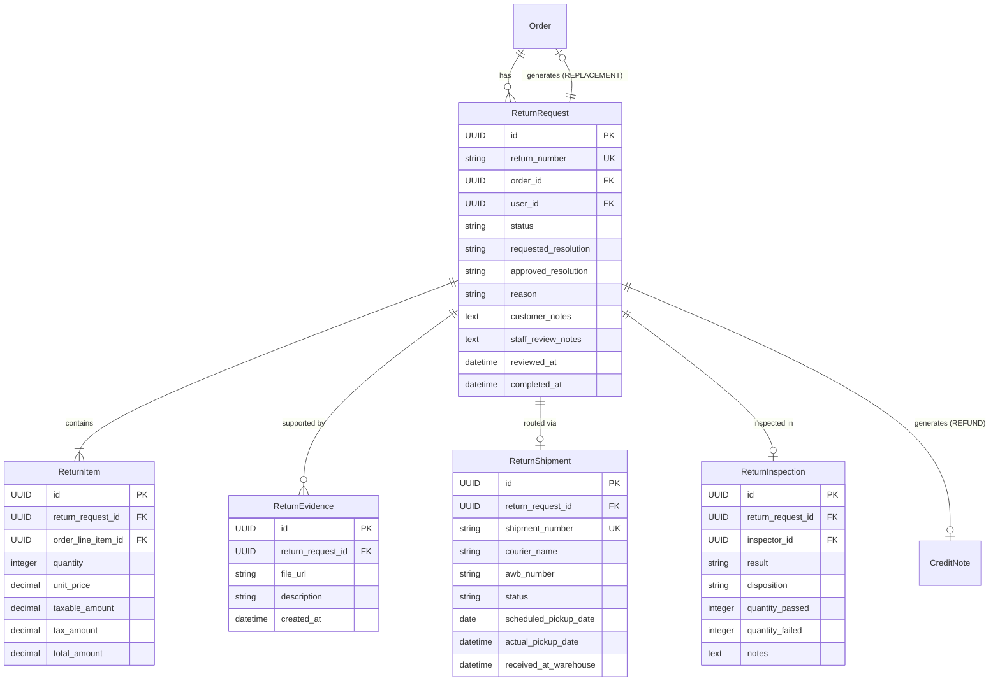
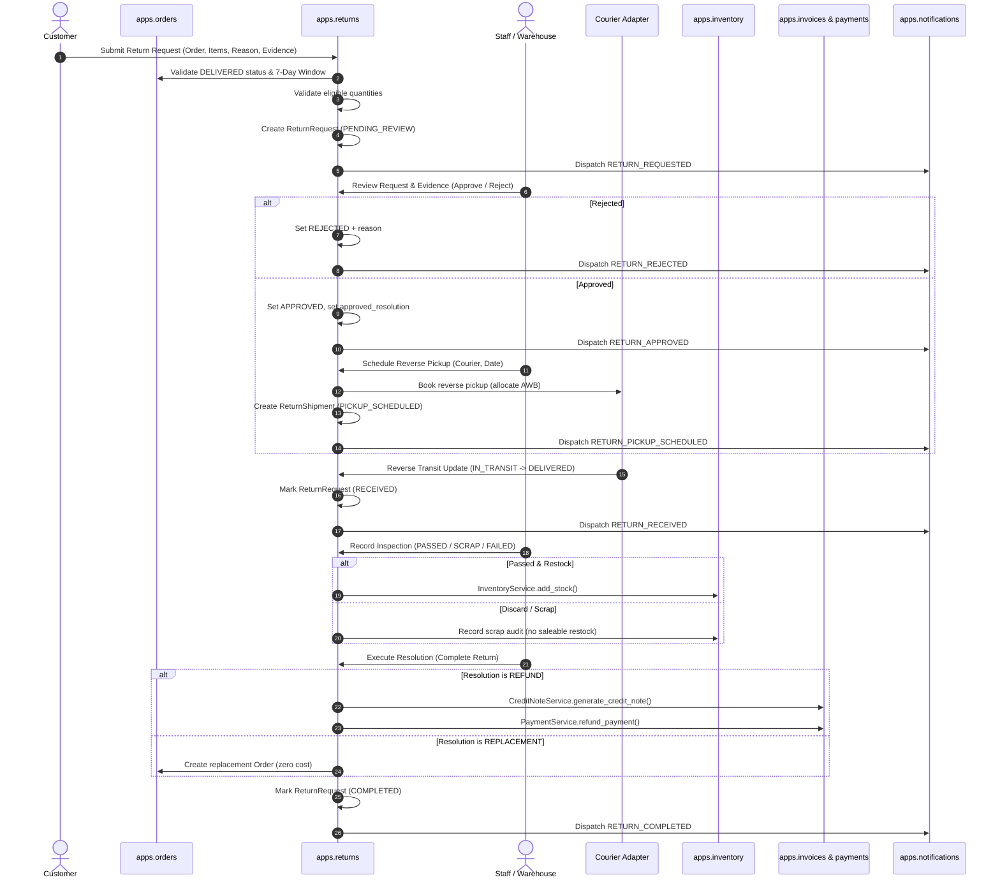

# PHASE 3.10 — PRE-IMPLEMENTATION COMPATIBILITY AUDIT
## Customer Returns, Replacements & Reverse Logistics (RMA)

**Platform:** Bharath Masala Products E-Commerce Platform (Production Django/DRF Backend)  
**Audit Date:** 2026-09-06  
**Auditor:** Antigravity AI Engine  
**Current Verified Baseline:** 348 / 348 Tests Passing (100% Green)  
**Quality Gates Status:** All 4 Gates Passing (`check`, `makemigrations`, `black`, `ruff`)

---

## 1. Executive Summary & Audit Objective

The objective of this pre-implementation audit is to evaluate the technical feasibility, statutory constraints, model design, state machines, concurrency controls, and integration points for implementing **Phase 3.10: Customer Returns, Replacements & Reverse Logistics (RMA)**.

Phase 3.9 successfully delivered financial recovery for pre-delivery cancellations and courier Return-to-Origin (RTO). However, post-delivery customer-initiated returns for premium spices, broken seals, defective goods, or damaged transit require a specialized business domain conforming to:
1. **Consumer Protection (E-Commerce) Rules, 2020**: Clear 7-day return window, transparent refund/replacement tracking, and photographic evidence validation.
2. **Food Safety and Standards Authority of India (FSSAI) Norms**: Strict segregation of returned food products into saleable restock vs scrap/write-off disposition (unsealed or contaminated spices must never re-enter saleable inventory).
3. **Statutory GST Credit Notes & Refunds**: Seamless integration with Phase 3.9's `CreditNoteService` (Rule 53(1A) compliance) and `PaymentService.refund_payment`.

---

## 2. Compatibility Matrix Across Existing Domains

| Existing Domain | Current Capability | Phase 3.10 Touchpoint / Integration Requirement | Risk Level |
| :--- | :--- | :--- | :--- |
| **`apps.orders`** | `Order`, `OrderLineItem`, `OrderStatus` (`DELIVERED`, `REFUNDED`), `OrderStateMachine` | Must validate return requests only against `DELIVERED` orders within the 7-day window. Must prevent returning more than net delivered quantity. | **Low** (read-only queries + optional transition to `REFUNDED` or replacement order) |
| **`apps.shipping`** | `CourierAdapterInterface`, `MockCourierAdapter`, `CourierProvider` | Reverse logistics requires generating reverse pickup requests, reverse AWBs, and tracking reverse transit. Reuses courier enum and adapter pattern. | **Low** (reusable courier adapter interface) |
| **`apps.inventory`** | `StockItem`, `StockMovement`, `InventoryService.add_stock` | Warehouse inspection must determine whether returned spice items can be restocked (`RESTOCK`) or must be safely disposed (`DISCARD`). Saleable restock calls `InventoryService.add_stock`. | **Low** (contract already verified in Phase 3.9) |
| **`apps.invoices`** | `CreditNoteSequence`, `CreditNote`, `CreditNoteLine`, `CreditNoteService` | `CreditNoteReason.CUSTOMER_RETURN` is already defined. `CreditNoteService.generate_credit_note` already accepts partial item-level adjustments (`items_data`). | **Zero** (plug-and-play capability) |
| **`apps.payments`** | `Payment`, `PaymentAttempt`, `PaymentService.refund_payment` | Direct gateway refund execution via Razorpay or manual settlement. Preserves universal `Order` → `Payment` locking. | **Zero** (contract already verified in Phase 3.9) |
| **`apps.notifications`** | Multi-channel adapters (Email, WhatsApp, SMS), `NotificationService` | Adding return lifecycle notification events: `RETURN_REQUESTED`, `RETURN_APPROVED`, `RETURN_REJECTED`, `RETURN_PICKED_UP`, `RETURN_RECEIVED`, `RETURN_COMPLETED`. | **Low** (standard template addition) |
| **`apps.accounts`** | `User`, `IsStaffOrManager`, address book | Strict IDOR checks (`order.user == request.user`) for customer submissions; staff permissions for approval, inspection, and completion. | **Zero** (standard DRF permission classes) |

---

## 3. Domain Separation & Architecture Strategy

In accordance with architectural guidelines established in Phase 3.8 and 3.9, we establish a dedicated Django app:
```
apps/returns/
├── __init__.py
├── apps.py
├── models.py                   # ReturnRequest, ReturnItem, ReturnEvidence, ReturnShipment, ReturnInspection
├── exceptions.py               # ReturnPolicyViolation, ReturnConflict, ReturnError
├── serializers.py              # Customer & staff serializers with nested validations
├── services/
│   ├── __init__.py
│   ├── return_service.py       # Customer request intake, policy validation (7-day window, quantity checks)
│   ├── review_service.py       # Staff approval/rejection with resolution designation
│   ├── reverse_logistics.py    # Courier pickup booking, reverse AWB, transit synchronization
│   ├── inspection_service.py   # Warehouse quality check, disposition (RESTOCK vs DISCARD)
│   └── resolution_service.py   # Execution of REFUND (CreditNote + PaymentService) or REPLACEMENT
├── views.py                    # Customer REST endpoints (IDOR safe)
├── staff_views.py              # Staff management REST endpoints ([IsAuthenticated, IsStaffOrManager])
├── urls.py                     # Mounted at /api/v1/orders/
├── staff_urls.py               # Mounted at /api/v1/staff/returns/
├── tasks.py                    # Celery asynchronous notifications & reverse courier polling
├── admin.py                    # Django admin registration
└── tests/
    ├── __init__.py
    ├── test_return_requests.py # Customer requests, policy validation, 7-day cutoff, IDOR
    ├── test_reverse_logistics.py # Reverse pickup booking, carrier tracking, warehouse arrival
    └── test_inspection_and_resolution.py # Warehouse inspection, FSSAI disposal/restock, credit note & refund
```

---

## 4. Detailed Data Models & Schema Design

### 4.1 Enums & Choices

```python
class ReturnRequestStatus(models.TextChoices):
    PENDING_REVIEW = "PENDING_REVIEW", "Pending Staff Review"
    APPROVED = "APPROVED", "Approved for Pickup"
    REJECTED = "REJECTED", "Rejected"
    PICKUP_SCHEDULED = "PICKUP_SCHEDULED", "Reverse Pickup Scheduled"
    IN_TRANSIT = "IN_TRANSIT", "In Transit to Warehouse"
    RECEIVED = "RECEIVED", "Received at Warehouse"
    INSPECTED = "INSPECTED", "Inspection Completed"
    COMPLETED = "COMPLETED", "Completed (Resolved)"
    CANCELLED = "CANCELLED", "Cancelled by Customer"

class ReturnReason(models.TextChoices):
    DAMAGED_IN_TRANSIT = "DAMAGED_IN_TRANSIT", "Damaged in Transit / Crushed Packaging"
    DEFECTIVE_QUALITY = "DEFECTIVE_QUALITY", "Quality Defect / Moisture / Aroma Loss"
    WRONG_ITEM_DELIVERED = "WRONG_ITEM_DELIVERED", "Wrong Item / Variant Delivered"
    TAMPERED_SEAL = "TAMPERED_SEAL", "Tampered Safety Seal / Broken Seal"
    EXPIRED_OR_NEAR_EXPIRY = "EXPIRED_OR_NEAR_EXPIRY", "Expired or Close to Expiry Date"
    MISSING_ITEMS = "MISSING_ITEMS", "Missing Items / Shortage in Package"
    OTHER = "OTHER", "Other (Requires Staff Review)"

class ResolutionType(models.TextChoices):
    REFUND = "REFUND", "Monetary Refund & GST Credit Note"
    REPLACEMENT = "REPLACEMENT", "Free Replacement Shipment"

class InspectionResult(models.TextChoices):
    PASSED = "PASSED", "Passed Quality Inspection"
    FAILED = "FAILED", "Failed (Fraudulent / User-Damaged / Mismatched Item)"
    SCRAP_DAMAGED = "SCRAP_DAMAGED", "Authentic Defect / Unsaleable (Food Safety Scrap)"

class InventoryDisposition(models.TextChoices):
    RESTOCK = "RESTOCK", "Restock into Saleable Physical Inventory"
    DISCARD = "DISCARD", "Write-Off / Discard as Unsaleable Scrap"
    RETURN_TO_CUSTOMER = "RETURN_TO_CUSTOMER", "Reject & Return to Customer"
```

### 4.2 Entity Relationship Diagram



---

## 5. End-to-End RMA Lifecycle Flow



---

## 6. Statutory & Policy Compliance Analysis

### 6.1 Return Window Enforcement
* **Rule**: Spices and food products must be claimed within **7 days** of delivery.
* **Implementation**:
  ```python
  return_window = getattr(settings, "RETURN_POLICY_WINDOW_DAYS", 7)
  delivery_cutoff = order.delivered_at + timezone.timedelta(days=return_window)
  if timezone.now() > delivery_cutoff:
      raise ReturnPolicyViolation(
          f"Return window expired. Returns must be requested within {return_window} days of delivery."
      )
  ```

### 6.2 Net Quantity Accounting & Anti-Fraud Invariant
* **Rule**: A customer cannot request a return for more items than were delivered, nor can they file multiple return requests for the same delivered units.
* **Implementation**:
  $$\text{Eligible Quantity} = \text{Delivered Quantity} - \sum \text{Previously Requested/Returned Quantity}$$
  Any attempt to exceed this threshold raises `ReturnPolicyViolation`.

### 6.3 FSSAI Food Safety & Restock Quarantine
* Spices with broken seals or signs of contamination must never be mixed back with saleable warehouse stock.
* Inspection enforces `disposition`:
  - `RESTOCK`: Sealed, unblemished tins/pouches returned due to incorrect variant delivery or cancelled dispatch.
  - `DISCARD`: Tampered, defective, or infested goods written off to scrap loss.

---

## 7. Quality Gate Guarantees & Verification Plan

Prior to writing any code, the following constraints must be preserved:
1. **Existing Test Suite**: All 348 existing tests must remain 100% green.
2. **Zero Schema Drift**: New migrations strictly confined to `apps/returns/migrations/0001_initial.py` and notifications event choices.
3. **Format & Linting**: Strict adherence to `black` and `ruff`.
4. **Targeted Test Suite**: Minimum 20+ automated tests covering:
   - Policy validation (7-day window, delivered status, quantity caps).
   - Customer IDOR protection and permission restrictions.
   - Staff review, approval, and rejection workflows.
   - Reverse pickup booking with mock courier adapter.
   - Warehouse inspection results (restock vs discard).
   - Execution of refund (CreditNote + Payment refund) and replacement order creation.
   - Multi-channel notification delivery.

---

## 8. Conclusion & Recommendation

The Phase 3.10 architecture has been audited and found to be completely compatible with the existing Bharath Masala platform. It reuses existing contracts in `apps.orders`, `apps.shipping`, `apps.inventory`, `apps.invoices`, `apps.payments`, and `apps.notifications` without breaking backward compatibility.

We are ready to present the detailed Implementation Plan for user review and approval.
