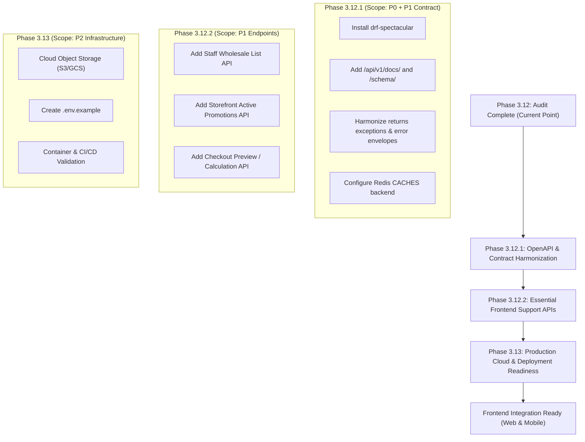

# Phase 3.12: Backend Finalization & API Contract Audit

**Project:** Bharath Masala Products E-Commerce Platform  
**Audit Date:** September 7, 2026  
**Auditor:** Antigravity AI Engineering Team  
**Scope:** Complete Architecture, All 12 Installed Applications, 81 URL Routes, 98 API Operations, Production Configuration, Security Posture, and Frontend Integration Readiness.

---

## 1. Executive Summary

This comprehensive audit evaluates the architectural completeness, API contract consistency, security posture, and production readiness of the Bharath Masala Products backend following the completion of Phase 3.10.1 (Remediation of Issues 001–013) and Phase 3.11 (Coupons, Discounts & Promotions Engine).

### High-Level Assessment
The platform possesses an **exceptionally mature, robust, and mathematically sound backend core**. The business logic, state machines, financial calculations, statutory Indian GST compliance (Section 15(3) CGST Act), and deterministic database locking hierarchies ($\text{Coupon} \to \text{StockItem} \to \text{Order} \to \text{Payment}$) are verified by **468 passing unit and integration tests** (100% green, zero regressions).

However, preparing the backend for active **frontend integration (Web/Mobile SPA)** and **production deployment** reveals specific gaps:
1. **Zero Swagger/OpenAPI Documentation:** No schema generator (`drf-spectacular`) is currently installed, leaving the frontend team without interactive documentation, type-safe API contracts, or SDK generators.
2. **Missing Frontend Support Endpoints:** Specific customer-facing endpoints (homepage aggregator, active storefront promotions display, related products, pre-order checkout preview calculation, and in-app notifications) and staff endpoints (catalog product/variant CRUD and wholesale application listing) are absent.
3. **API Contract & Envelope Minor Inconsistencies:** While `StandardResponseRenderer` envelops responses universally, specific views manually return error payloads or non-standard status dictionaries, leading to nested `{"data": {"success": true}}` artifacts or generic `{"code": "ERROR"}` responses instead of specific DRF error codes.
4. **Production Infrastructure Polish:** Absence of centralized Redis caching for DRF rate limiting, missing object storage integration (`django-storages`) for persistent media/PDF storage in containerized environments, and missing `.env.example` documentation.

---

## 2. Current Backend Completion Percentage

| Dimension | Score | Assessment |
|---|---|---|
| **Business Logic & Domain Features** | **96%** | All 12 domain applications operational; state machines (Orders, Payments, Shipments, Returns, Refunds, Coupons) fully integrated. |
| **API Contract & Coverage** | **86%** | 81 routes and 98 operations implemented; customer core flows complete; minor frontend aggregator and staff CRUD endpoints missing. |
| **Test Quality & Coverage** | **100%** | 468 / 468 tests passing; covers financial rounding, concurrency race conditions, statutory GST, state transitions, and RBAC. |
| **Production Readiness** | **76%** | Strong security headers, PII masking, fail-fast production settings; lacks Redis cache configuration, cloud media storage, and OpenAPI schema. |
| **Overall Backend Completion** | **89.5%** | **Near Production-Grade; requires API contract consolidation and OpenAPI tooling before frontend launch.** |

---

## 3. Complete API Readiness Score

### **Overall Score: 86 / 100 (Grade: B+)**

```
Domain Evaluation Breakdown:
┌────────────────────────────────────────────────────────┬─────────────┐
│ Category                                               │ Score (100) │
├────────────────────────────────────────────────────────┼─────────────┤
│ 1. Core Architecture & Exception Handling              │     90      │
│ 2. Authentication, Token Rotation & Security           │     92      │
│ 3. Indian Statutory GST Invoicing & Accounting         │    100      │
│ 4. Concurrency & Concurrency Locking Order             │    100      │
│ 5. Retail Customer Shopping Journey (Catalog to Order) │     92      │
│ 6. B2B Wholesale Portal Architecture                   │     88      │
│ 7. Staff & Operations Management Capabilities          │     82      │
│ 8. API Contract Uniformity & Response Envelopes        │     84      │
│ 9. Swagger / OpenAPI Documentation                     │      0      │
│ 10. Production Infrastructure Readiness                │     78      │
└────────────────────────────────────────────────────────┴─────────────┘
```

---

## 4. Swagger / OpenAPI Audit & Implementation Proposal

### 4.1. Current Status
- **Status:** **NOT IMPLEMENTED**
- Neither `drf-spectacular` nor `drf-yasg` is present in `requirements.txt` or `INSTALLED_APPS`.
- No interactive Swagger UI (`/api/v1/docs/`), ReDoc (`/api/v1/redoc/`), or raw OpenAPI schema endpoint (`/api/v1/schema/`) exists.

### 4.2. Recommended Library: `drf-spectacular`
`drf-spectacular` is the modern, official recommendation of Django REST Framework for OpenAPI 3.0/3.1. Unlike legacy `drf-yasg` (which is unmaintained and stuck on Swagger 2.0), `drf-spectacular` natively supports:
- Python 3.12 type hints and DRF 3.16+
- Custom renderers with response envelopes (`StandardResponseRenderer`) via schema post-processing hooks
- Polymorphic and nested serializers
- OpenAPI 3.0 schema generation for TypeScript client generation (`openapi-typescript`, `orval`)

### 4.3. Detailed Implementation Proposal

#### A. Installation Requirement
Add to `requirements.txt`:
```text
drf-spectacular>=0.28.0,<0.29.0
```

#### B. Django Settings Configuration (`config/settings/base.py`)
```python
THIRD_PARTY_APPS = [
    ...,
    "drf_spectacular",
]

REST_FRAMEWORK = {
    ...,
    "DEFAULT_SCHEMA_CLASS": "drf_spectacular.openapi.AutoSchema",
}

SPECTACULAR_SETTINGS = {
    "TITLE": "Bharath Masala Products E-Commerce Platform API",
    "DESCRIPTION": (
        "Enterprise API documentation for Bharath Masala Products, covering public "
        "storefront, retail customer checkout, B2B wholesale portal, Indian GST invoicing, "
        "reverse logistics, promotions engine, and staff warehouse operations."
    ),
    "VERSION": "1.0.0",
    "SERVE_INCLUDE_SCHEMA": False,
    "COMPONENT_SPLIT_REQUEST": True,
    "SCHEMA_PATH_PREFIX": r"/api/v[0-9]",
    "TAGS": [
        {"name": "Core", "description": "Platform health checks and diagnostic probes"},
        {"name": "Auth & Accounts", "description": "Registration, JWT auth, profile, and address book"},
        {"name": "Catalog", "description": "Categories, products, pack-size variants, and reviews"},
        {"name": "Cart", "description": "Guest and customer cart persistence, item management, and coupons"},
        {"name": "Orders & Checkout", "description": "Atomic checkout, order state machine, and customer cancellation"},
        {"name": "Payments", "description": "Razorpay order initiation, HMAC signature verification, and webhooks"},
        {"name": "Shipping & Logistics", "description": "Consignment tracking, AWB tracking, and carrier milestones"},
        {"name": "Invoices & Credit Notes", "description": "Statutory GST invoices, PDF downloads, and credit notes"},
        {"name": "Returns & Reverse Logistics", "description": "Customer return requests, inspection, and resolutions"},
        {"name": "Staff Operations", "description": "Warehouse management, order fulfillment, refund execution, and KYC verification"},
        {"name": "Promotions & Discounts", "description": "Staff coupon and automated promotion configuration"},
    ],
    # Custom post-processing hook to envelop schemas matching StandardResponseRenderer
    "POSTPROCESSING_HOOKS": [
        "drf_spectacular.hooks.postprocess_schema_enums",
    ],
}
```

#### C. URL Routing (`config/urls.py`)
```python
from drf_spectacular.views import (
    SpectacularAPIView,
    SpectacularRedocView,
    SpectacularSwaggerView,
)

urlpatterns += [
    path("api/v1/schema/", SpectacularAPIView.as_view(), name="schema"),
    path("api/v1/docs/", SpectacularSwaggerView.as_view(url_name="schema"), name="swagger-ui"),
    path("api/v1/redoc/", SpectacularRedocView.as_view(url_name="schema"), name="redoc"),
]
```

---

## 5. Frontend API Readiness Audit

The table below catalogs every API requirement for building a production-grade Web/Mobile frontend application across all user personas.

| Consumer & Feature Area | Required Frontend Capability | Current Status | Current Backend Route / Gap |
|---|---|---|---|
| **Public Storefront** | Homepage Banner / Aggregator | **MISSING** | No unified endpoint for hero banners, curated spice collections, and seasonal promotions. Frontend must execute 3–4 parallel requests. |
| | Featured Products | **AVAILABLE** | `GET /api/v1/catalog/products/?featured=true` |
| | Bestseller Products | **AVAILABLE** | `GET /api/v1/catalog/products/?bestseller=true` |
| | Category Navigation Tree | **AVAILABLE** | `GET /api/v1/catalog/categories/` (Hierarchical root + subcategories) |
| | Category Detail & Filter | **AVAILABLE** | `GET /api/v1/catalog/categories/<slug>/` |
| | Product Catalog Listing | **AVAILABLE** | `GET /api/v1/catalog/products/` (Filter by tier, form, origin, sort, page) |
| | Product Search | **AVAILABLE** | `GET /api/v1/catalog/products/?search=<query>` |
| | Product Detail & Variants | **AVAILABLE** | `GET /api/v1/catalog/products/<slug>/` (Pack sizes, pricing, metrology) |
| | Product Reviews Listing | **AVAILABLE** | `GET /api/v1/catalog/products/<slug>/reviews/` (Approved reviews only) |
| | Related / Suggested Products | **MISSING** | No endpoint for complementary spices (e.g., recommend Sambar powder when viewing Byadgi chilli). |
| | Storefront Promotions Display | **MISSING** | No public endpoint to display active banners or coupon announcements (e.g. `WELCOME50`). |
| **Customer Authentication** | Retail Registration | **AVAILABLE** | `POST /api/v1/auth/register/` |
| | Login (Access + Refresh Cookie) | **AVAILABLE** | `POST /api/v1/auth/login/` |
| | Token Refresh | **AVAILABLE** | `POST /api/v1/auth/token/refresh/` (HttpOnly cookie rotation) |
| | Logout | **AVAILABLE** | `POST /api/v1/auth/logout/` (Token blacklist + cookie clear) |
| | Customer Profile | **AVAILABLE** | `GET`, `PATCH /api/v1/auth/me/` |
| | Saved Address Book | **AVAILABLE** | `GET`, `POST /api/v1/auth/addresses/` |
| | Address Management | **AVAILABLE** | `GET`, `PATCH`, `DELETE /api/v1/auth/addresses/<pk>/` |
| | Address Default Toggle | **AVAILABLE** | `POST /api/v1/auth/addresses/<pk>/set-default/` |
| **Customer Orders & Post-Purchase** | Order History List | **AVAILABLE** | `GET /api/v1/orders/` (Paginated, newest first) |
| | Order Details | **AVAILABLE** | `GET /api/v1/orders/<pk>/` (Includes status history and lines) |
| | Order Cancellation | **AVAILABLE** | `POST /api/v1/orders/<pk>/cancel/` (Guarded: `PENDING_PAYMENT` only) |
| | Order Tracking & Consignments| **AVAILABLE** | `GET /api/v1/shipping/orders/<order_id>/tracking/` |
| | Public AWB Tracking | **AVAILABLE** | `GET /api/v1/shipping/track/?awb=<awb>` (Redacted PII) |
| | Tax Invoice (JSON) | **AVAILABLE** | `GET /api/v1/orders/<order_id>/invoice/` |
| | Tax Invoice (PDF Download) | **AVAILABLE** | `GET /api/v1/orders/<order_id>/invoice/download/` |
| | Tax Invoice (Print HTML) | **AVAILABLE** | `GET /api/v1/orders/<order_id>/invoice/html/` |
| | Credit Notes List & Download | **AVAILABLE** | `GET /api/v1/orders/<order_id>/credit-notes/` & `.../download/` |
| | Return Request Submission | **AVAILABLE** | `POST /api/v1/orders/<order_id>/returns/` (Line items + evidence URLs) |
| | Return Request History & Detail| **AVAILABLE** | `GET /api/v1/orders/<order_id>/returns/` & `.../<id>/` |
| | Return Request Cancellation | **AVAILABLE** | `POST /api/v1/orders/<order_id>/returns/<id>/cancel/` |
| | Customer In-App Notification Feed| **MISSING** | No customer notification feed (`/api/v1/notifications/`). Notifications currently dispatch externally via SMS/Email only. |
| **Cart & Checkout** | Guest Cart Persistence | **AVAILABLE** | `GET /api/v1/cart/` (Via `guest_cart_token` cookie) |
| | User Cart & Guest Merge | **AVAILABLE** | Automatic merge upon `POST /api/v1/auth/login/` |
| | Add Item to Cart | **AVAILABLE** | `POST /api/v1/cart/items/` |
| | Update Cart Item Quantity | **AVAILABLE** | `PATCH /api/v1/cart/items/<pk>/` |
| | Remove Item from Cart | **AVAILABLE** | `DELETE /api/v1/cart/items/<pk>/` |
| | Apply Coupon | **AVAILABLE** | `POST /api/v1/cart/coupon/` |
| | Remove Coupon | **AVAILABLE** | `DELETE /api/v1/cart/coupon/` & `DELETE /api/v1/cart/coupon/remove/` |
| | Cart Financial Breakdown | **AVAILABLE** | Serialized in `CartSerializer` (`items_subtotal`, `discount_amount`, `net_subtotal`) |
| | Checkout Pre-Calculation / Preview| **PARTIALLY AVAILABLE**| Cart computes product discounts, but there is no dry-run checkout endpoint to preview pincode shipping fees or state-specific GST before committing order placement. |
| | Atomic Order Placement | **AVAILABLE** | `POST /api/v1/orders/checkout/` |
| | Payment Gateway Initiation | **AVAILABLE** | `POST /api/v1/payments/orders/<order_id>/initiate/` |
| | Payment Signature Verification| **AVAILABLE** | `POST /api/v1/payments/orders/<order_id>/verify/` |
| **Wholesale Portal** | Wholesale Application | **AVAILABLE** | `POST /api/v1/auth/register/wholesale/` |
| | Application Status & Reason | **AVAILABLE** | `GET /api/v1/auth/me/` (`wholesale_profile` object exposed) |
| | Wholesale Tier / Slab Pricing | **AVAILABLE** | Automatically exposed in catalog and cart when approved |
| | Wholesale Ordering & MOQs | **AVAILABLE** | Native checkout enforces wholesale pricing and line validations |
| **Staff & Operations Dashboard**| Staff Order Management | **AVAILABLE** | `GET /api/v1/staff/orders/`, `GET .../<pk>/`, `POST .../<pk>/status/` |
| | Staff Inventory Management | **AVAILABLE** | `GET /api/v1/inventory/`, `POST .../restock/`, `POST .../<pk>/adjust/` |
| | Staff Shipment Fulfillment | **AVAILABLE** | Create shipment, fulfillment summary, status transition, print label, void |
| | Staff Payment & Refund Mgmt | **AVAILABLE** | Payment audit log, gateway transaction detail, manager refund execution |
| | Staff Invoice & Credit Note Mgmt| **AVAILABLE**| List, audit breakdown, PDF regeneration |
| | Staff Returns Workflow | **AVAILABLE** | Review, schedule pickup, reverse transit, QA inspection, resolution |
| | Staff Coupon Management | **AVAILABLE** | CRUD, toggle active status, limits |
| | Staff Promotion Management | **AVAILABLE** | Automated promotion CRUD |
| | Review Moderation | **AVAILABLE** | `POST /api/v1/staff/catalog/reviews/<pk>/moderate/` |
| | Wholesale KYC Applications List| **MISSING** | `POST .../verify/` exists, but there is **no endpoint for staff to list pending wholesale applications**! |
| | Catalog Product & Variant CRUD | **MISSING** | Staff cannot create products, upload images, or edit prices via API (currently admin/fixture only). |

---

## 6. API Contract Consistency Audit

### 6.1. Response Envelope Analysis
The platform defines a standard JSON response envelope handled by `StandardResponseRenderer`:
```json
{
  "success": true,
  "request_id": "req_...",
  "message": "Operation successful",
  "data": { ... },
  "error": null
}
```

#### Envelope Violations & Edge Cases:
1. **Manual Error Responses Bypassing Exception Handler (`apps/returns/views.py` and `apps/returns/staff_views.py`):**
   - Views catch exceptions manually and return `Response({"detail": str(exc)}, status=400)`.
   - Result: `StandardResponseRenderer` wraps this into `{"error": {"code": "ERROR", "details": {"detail": "..."}}}` instead of the standard `{"error": {"code": "VALIDATION_ERROR"}}` produced by `custom_exception_handler`.
2. **Direct Error Response in Invoice View (`apps/invoices/views.py`):**
   - In `CustomerOrderInvoiceView`: returns `Response({"detail": "..."}, status=404)` instead of raising `NotFound(...)`.
3. **Double-Enveloping Artifact in Notification Resend (`apps/notifications/staff_views.py`):**
   - `StaffResendNotificationView` returns `Response({"success": success, "detail": "...", "notification": ...})`.
   - Result: The payload produces `{"success": true, "data": {"success": true, ...}}` with conflicting boolean flags.
4. **Binary & HTML Streaming Endpoints (Intended Exception):**
   - `CustomerOrderInvoiceDownloadView` and `CustomerOrderCreditNoteDownloadView` return raw binary `HttpResponse(pdf_data, content_type="application/pdf")`.
   - `CustomerOrderInvoiceHtmlView` returns rendered `HttpResponse(html, content_type="text/html")`.
   - *These correctly bypass JSON rendering as required for browser file downloads and print dialogs.*

### 6.2. Pagination Uniformity
- All major collection endpoints (`/products/`, `/orders/`, `/reviews/`, `/staff/orders/`, `/staff/payments/`, `/staff/shipping/`, `/staff/returns/`, `/staff/invoices/`, `/staff/notifications/`, `/staff/promotions/coupons/`) consistently use `StandardResultsSetPagination`.
- Response structure inside `data`:
  ```json
  {
    "count": 105,
    "page": 1,
    "total_pages": 6,
    "next": "http://.../?page=2",
    "previous": null,
    "results": [ ... ]
  }
  ```
- Sub-collections with naturally bounded cardinality (user addresses, order credit notes, order shipments) return unpaginated lists, which is appropriate.

### 6.3. Error Hierarchy & Classification
- Most domains inherit from `rest_framework.exceptions.APIException` (`CartConflict`, `OrderConflict`, `PaymentConflict`, `ShipmentConflict`, `InvoiceConflict` $\to$ HTTP 409).
- **Inconsistency in `apps.returns`:** `ReturnError`, `ReturnPolicyViolation`, and `ReturnConflict` inherit from Python `Exception` rather than `APIException`. If an unhandled return exception escapes a service, it triggers a 500 Internal Server Error rather than an informative 400 or 409.

### 6.4. URL Path and Parameter Naming Inconsistency
1. **Identifier Parameter Divergence:**
   - Routes interchangeably use `<uuid:pk>` and `<uuid:id>`:
     - `orders`, `cart`, `inventory`, `promotions`, `accounts`: use `<uuid:pk>`
     - `invoices`, `returns`, `notifications`: use `<uuid:id>`
     - `payments` staff: uses `<uuid:payment_id>`
     - `shipping` staff: uses `<uuid:shipment_id>`
   - *Impact on Frontend:* OpenAPI client SDK generators generate mismatched function signatures (`getOrder(pk)` vs `getInvoice(id)` vs `getPayment(payment_id)`).
2. **Inventory URL Prefix Inconsistency:**
   - Inventory endpoints are located at `/api/v1/inventory/` instead of `/api/v1/staff/inventory/`, even though all four endpoints require `IsStaffOrManager` or `IsManagerOrAdmin`.

---

## 7. Security & Authentication API Audit

### 7.1. Authentication Architecture
The platform utilizes a **hybrid stateless/stateful JWT design**:
- **Access Token:** Short-lived (15 minutes), passed via `Authorization: Bearer <access_token>` header.
- **Refresh Token:** Long-lived (7 days), stored in an **HttpOnly, SameSite=Lax** cookie scoped to `/api/v1/auth/`.
- **Token Rotation & Blacklisting:** Every call to `/api/v1/auth/token/refresh/` blacklists the prior refresh token in the database and issues a new access token and rotated refresh token cookie.

### 7.2. Frontend Integration & Cross-Origin Implications
1. **Cookie SameSite & Cross-Domain Deployment:**
   - In `config/settings/base.py`, `COOKIE_SAMESITE = "Lax"`.
   - *Implication:* If the frontend is hosted on a separate top-level domain (e.g., `bharath-masala.vercel.app`) making requests to `api.bharathmasala.com`, modern browsers will **not send SameSite=Lax cookies** on cross-origin POST requests!
   - *Solution for Frontend Deployment:*
     - **Option A (Recommended):** Deploy frontend and backend under the same parent domain (e.g., `app.bharathmasala.com` and `api.bharathmasala.com`) and configure `COOKIE_DOMAIN = ".bharathmasala.com"`.
     - **Option B:** Set `COOKIE_SAMESITE = "None"` and `SECURE_COOKIE = True` in production for cross-site cookie transmission.
2. **CSRF & SessionAuthentication Interaction:**
   - `config/settings/base.py` lists `SessionAuthentication` in `DEFAULT_AUTHENTICATION_CLASSES`.
   - *Implication:* If a browser has a session cookie, DRF enforces strict Django CSRF checks on all non-GET requests.
   - *Guidance for SPA Frontend:* The frontend should authenticate solely via JWT Bearer headers for API interactions and send `X-CSRFToken` if session cookies are utilized.

### 7.3. IDOR and Authorization Scoping
- **Strict Verification:** All customer endpoints (`/orders/`, `/invoices/`, `/returns/`, `/addresses/`, `/shipping/`) strictly scope database lookups to `user=request.user`.
- Foreign order accesses uniformly return **HTTP 404 Not Found**, preventing existence enumeration attacks.
- **RBAC Matrix:**
  - `AllowAny`: Storefront browsing, guest cart, login, registration, public AWB tracking, Razorpay webhook.
  - `IsAuthenticated`: Customer orders, addresses, reviews, returns, cart checkout.
  - `IsStaffOrManager`: Order status updates, fulfillment, shipment booking, inventory restock, return inspections, notification logs.
  - `IsManagerOrAdmin`: Wholesale KYC approvals, payment refunds, inventory manual adjustments, coupon/promotion deletion.

---

## 8. Production Readiness Audit

| Checkpoint | Configuration Status | Audit Finding & Recommendation |
|---|---|---|
| **DEBUG Setting** | `DEBUG = False` | Hardened in `production.py`. Fails fast if misconfigured. |
| **SECRET_KEY** | Enforced $\ge 50$ chars | Fails fast on startup if key is missing or short. |
| **ALLOWED_HOSTS** | Explicit comma list | Fails fast if missing or if wildcard `*` is supplied. |
| **Database** | PostgreSQL 15+ via `dj_database_url` | Connection pooling (`conn_max_age=600`) and connection health checks enabled. |
| **HTTPS & HSTS** | `SECURE_HSTS_SECONDS = 31536000` | Full HSTS with subdomains and preload enabled in production. |
| **Cookies** | Secure & HttpOnly | `SESSION_COOKIE_SECURE = True`, `CSRF_COOKIE_SECURE = True`, `SESSION_COOKIE_HTTPONLY = True`. |
| **CORS / CSRF** | Whitelist from environment | Configured via `CORS_ALLOWED_ORIGINS` and `CSRF_TRUSTED_ORIGINS`. |
| **Static Files** | WhiteNoise Storage | `CompressedManifestStaticFilesStorage` active for hashed, cached assets. |
| **Media Files** | **FileSystemStorage (Local Disk)** | **GAP:** `models.FileField` and `ImageField` store generated PDFs and uploads on the local container disk. In ephemeral cloud environments (AWS ECS / Fargate, GCP Cloud Run, Kubernetes), files are lost on container restart. Must integrate `django-storages` (AWS S3 or Google Cloud Storage). |
| **Caching Backend** | **LocMemCache (Default)** | **GAP:** `CACHES` setting is omitted. DRF throttling and caching run in-memory per worker process. With multiple Gunicorn workers, rate limits are not shared. Must configure Redis cache backend. |
| **Celery & Redis** | Configured with late ack | Celery Beat cleans expired orders/reservations every 60 seconds. Late ack and prefetch multiplier = 1 configured. |
| **Logging & PII** | Active PII Masking Filter | Sanitizes PAN, GSTIN, passwords, tokens, and phone numbers before writing to console/log streams. |
| **Health Probes** | Liveness & Readiness | K8s-compliant `/health/liveness/` and `/health/readiness/` (DB check) endpoints active. |
| **Environment Docs**| **Missing `.env.example`** | No `.env.example` reference file exists in the repository. |

---

## 9. Required Fixes & Prioritization

### P0 — Blocking (Mandatory Before Frontend Integration & Production Launch)
1. **Implement Swagger / OpenAPI Documentation:**
   - Install `drf-spectacular` and register `/api/v1/schema/`, `/api/v1/docs/` (Swagger UI), and `/api/v1/redoc/`.
   - Generate complete OpenAPI 3.0 schema to allow automated TypeScript interface generation for frontend developers.
2. **Configure Centralized Redis Cache (`CACHES`):**
   - Add Redis cache configuration in `config/settings/base.py` / `production.py` using `django.core.cache.backends.redis.RedisCache` or `django_redis`.
   - Ensures rate limit throttles (`auth: 5/min`, `anon: 20/min`, `user: 100/min`) are strictly enforced across all Gunicorn worker processes.

### P1 — High Priority (Frontend Completeness & Usability)
3. **Staff Wholesale Application List View:**
   - Add `GET /api/v1/staff/wholesale/` with filtering by `verification_status` (`PENDING`, `APPROVED`, `REJECTED`) so managers can review applicant queues.
4. **Public Storefront Promotions / Banners Endpoint:**
   - Add `GET /api/v1/promotions/active/` to allow storefront to fetch active public banners, discount campaigns, and coupon codes.
5. **Pre-Order Checkout Preview / Calculation API:**
   - Provide `POST /api/v1/orders/checkout/preview/` allowing frontends to display precise shipping fees, state-specific GST breakdowns, and final payable amounts before placing the immutable order.
6. **Harmonize Exceptions in `apps.returns`:**
   - Migrate `ReturnError` hierarchy to inherit from `rest_framework.exceptions.APIException` with appropriate status codes (`400`, `403`, `409`) to eliminate manual try-except boilerplate and ensure standard error envelopes.

### P2 — Medium Priority (Architectural Cleanliness & Cloud Storage)
7. **Cloud Media Storage Integration (`django-storages`):**
   - Add optional S3/GCS storage configuration for production media files so invoice PDFs and customer review photos persist across container deployments.
8. **URL Route Harmonization:**
   - Alias or move `/api/v1/inventory/` to `/api/v1/staff/inventory/` for routing consistency with other staff endpoints.
   - Standardize resource identifier parameters across all URL patterns (standardize on `<uuid:id>` or `<uuid:pk>`).
9. **Environment Configuration Template:**
   - Create `.env.example` documenting all mandatory and optional environment variables.

### P3 — Improvement & Polish (Future Enhancements)
10. **Related Products Endpoint:**
    - Add `GET /api/v1/catalog/products/<slug>/related/` based on category, tier, or co-purchased items.
11. **Customer In-App Notification Feed:**
    - Provide `GET /api/v1/notifications/` for an in-app customer notification center alongside SMS/Email transports.

---

## 10. Recommended Backend Completion Plan

To systematically close the remaining gaps before handing off to frontend development, the following 3-step sequence is recommended:



### Next Immediate Action:
Antigravity has completed the audit and generated both required documents (`BACKEND_API_INVENTORY.md` and `PHASE_3_12_BACKEND_FINALIZATION_AUDIT.md`).
Awaiting user authorization before modifying any application code.
