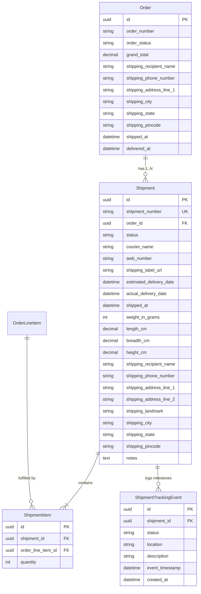
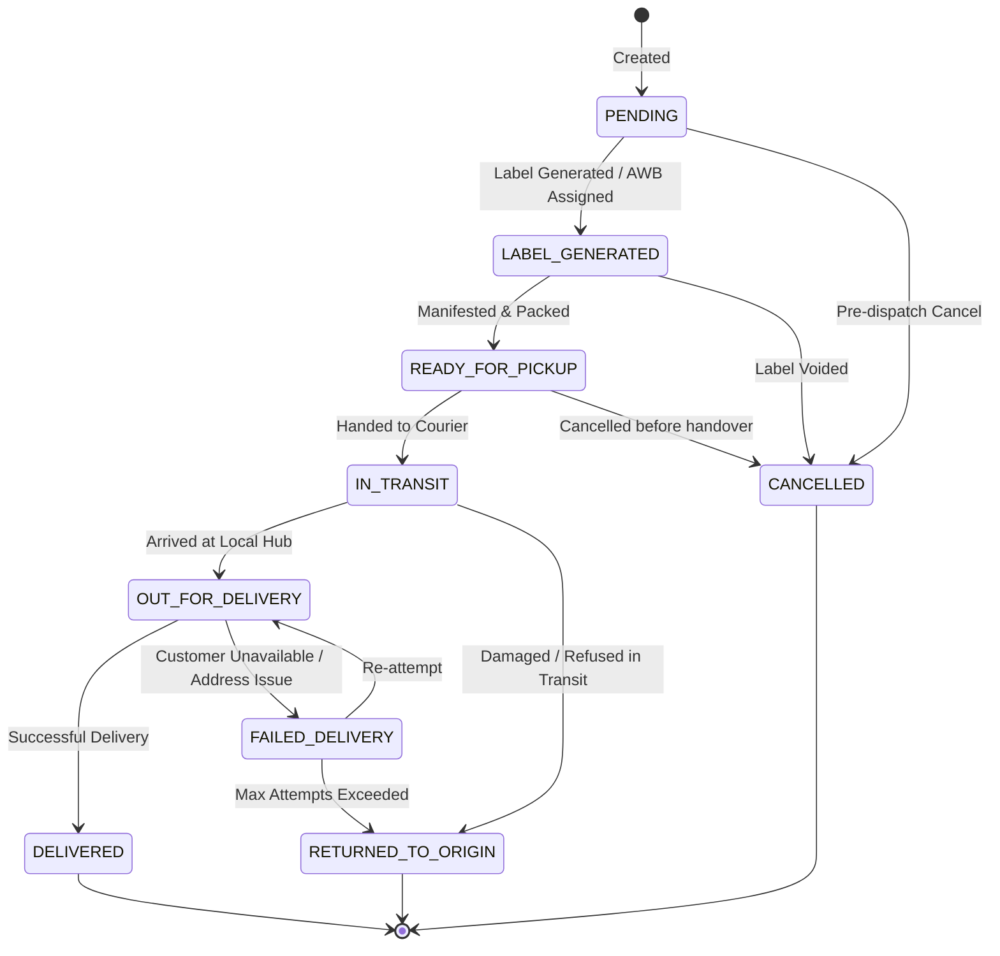

# PHASE 3.7 — SHIPPING, FULFILLMENT & DELIVERY DOMAIN
## PRE-IMPLEMENTATION COMPATIBILITY AUDIT REPORT

**Project:** Bharath Masala Products E-Commerce Platform  
**Backend:** Django 5.0.6, DRF 3.16.0, PostgreSQL 16, Redis 7, Celery 5.4.0, django-celery-beat 2.6.0  
**Audit Date:** 2026-09-06T18:15:00+05:30  
**Current Status:** PRE-IMPLEMENTATION AUDIT ONLY (Zero Production Code Modified)  
**Baseline Verified:** 227 / 227 tests passing (100% Green across all 7 applications)

---

## 1. Executive Summary & Audit Baseline

This audit establishes the comprehensive architectural design, domain boundaries, data models, state machine interactions, courier abstractions, partial shipment handling, IDOR protections, and staff fulfillment workflows for **Phase 3.7 — Shipping, Fulfillment & Delivery Domain**.

### Current Verified Baseline
* **Automated Tests:** 227 / 227 passing (`python3 manage.py test` — 46.30s)
  - `apps.core`: 14 tests
  - `apps.accounts`: 32 tests
  - `apps.catalog`: 41 tests
  - `apps.inventory`: 16 tests
  - `apps.cart`: 23 tests
  - `apps.orders`: 59 tests (including 25 background expiry & Celery task tests from Phase 3.6)
  - `apps.payments`: 42 tests
* **System Check:** Clean (`python3 manage.py check` — 0 issues)
* **Migration Drift:** Clean (`python3 manage.py makemigrations --check --dry-run` — No changes detected)
* **Code Formatting:** Clean (`black --check .` — 138 files unchanged)
* **Linter:** Clean (`ruff check .` — All checks passed)

---

## 2. Domain Boundary & Architecture: `apps.shipping` vs `apps.orders`

### 2.1 Separation of Concerns & Single Responsibility
In enterprise e-commerce platforms, commercial order management and physical logistics fulfillment represent distinct bounded contexts:

| Responsibility | Commercial Domain (`apps.orders`) | Logistics & Fulfillment Domain (`apps.shipping`) |
| :--- | :--- | :--- |
| **Entity Focus** | Financial agreements, customer invoices, line item pricing snapshots, discount rules. | Packages, physical parcels, carton dimensions, volumetric weights, dispatch manifests. |
| **Lifecycle** | `PENDING_PAYMENT` → `CONFIRMED` → `PROCESSING` → `SHIPPED` → `DELIVERED` → `REFUNDED`. | `PENDING` → `LABEL_GENERATED` → `READY_FOR_PICKUP` → `IN_TRANSIT` → `OUT_FOR_DELIVERY` → `DELIVERED` / `FAILED_DELIVERY` / `RETURNED_TO_ORIGIN`. |
| **External Integrations** | Payment Gateways (Razorpay, UPI, Banks). | Courier aggregators & 3PL logistics APIs (Delhivery, Shiprocket, Blue Dart, India Post). |
| **Granularity** | 1 Order per checkout session. | 1..N Shipments per Order (split packages, multiple warehouses, partial dispatches). |
| **Regulatory / Operational** | GST compliance, invoice numbers, payment transaction IDs. | Air Waybills (AWB), shipping labels (PDF/thermal ZPL), courier manifests, delivery proof. |

### 2.2 Architectural Recommendation: Dedicated `apps.shipping` App
Following the architectural precedent established by `apps.payments` in Phase 3.5, the logistics domain should be implemented as an independent, modular Django app: `apps.shipping`.

**Key Architectural Benefits:**
1. **Coupling Elimination:** Third-party courier SDKs, rate cards, webhook payloads, and label generators are isolated within `apps.shipping`, keeping `apps.orders` clean and stable.
2. **Clean Dependency Graph:**
   - `apps.shipping` imports from `apps.orders` (`Order`, `OrderLineItem`, `OrderStatus`, `OrderStateMachine`), `apps.accounts` (`IndianStates`, `IsStaffOrManager`), and `apps.core` (`TimeStampedModel`).
   - `apps.orders` does **not** import `apps.shipping`, eliminating any risk of circular dependencies.
3. **Pluggable Multi-Courier Architecture:** Allows adding support for Delhivery, Shiprocket, Blue Dart, India Post, or local hyper-local delivery without changing a single line of core order code.

---

## 3. Data Models & Relationship Design

### 3.1 Proposed Model Schema



### 3.2 Model Specifications

#### 1. `Shipment`
* **`id`**: UUID primary key (`default=uuid.uuid4`, `editable=False`).
* **`shipment_number`**: CharField (max_length=32, unique=True, db_index=True), formatted as `SHP-YYYYMMDD-XXXXX`.
* **`order`**: ForeignKey to `apps.orders.Order` (`on_delete=models.PROTECT`, `related_name="shipments"`).
* **`status`**: CharField (max_length=30, choices=`ShipmentStatus.choices`, default=`ShipmentStatus.PENDING`, db_index=True).
* **`courier_name`**: CharField (max_length=50, choices=`CourierProvider.choices`, default=`CourierProvider.MANUAL`, db_index=True).
* **`awb_number`**: CharField (max_length=100, blank=True, default="", db_index=True).
* **`shipping_label_url`**: URLField (max_length=500, blank=True, default="").
* **`estimated_delivery_date`**: DateField (null=True, blank=True).
* **`actual_delivery_date`**: DateTimeField (null=True, blank=True).
* **`shipped_at`**: DateTimeField (null=True, blank=True).
* **Parcel Dimensions & Weight**:
  - `weight_in_grams`: PositiveIntegerField (help_text="Total package physical/volumetric weight in grams").
  - `length_cm`: DecimalField (max_digits=6, decimal_places=2, null=True, blank=True).
  - `breadth_cm`: DecimalField (max_digits=6, decimal_places=2, null=True, blank=True).
  - `height_cm`: DecimalField (max_digits=6, decimal_places=2, null=True, blank=True).
* **Immutable Dispatch Address Snapshot**:
  - Copied directly from the parent `Order`'s immutable shipping address fields at shipment creation time. Ensures the warehouse packing slip and shipping label remain permanently frozen.
* **Constraints & Indexes**:
  - `CheckConstraint(check=Q(weight_in_grams__gt=0), name="shipment_weight_positive")`
  - `Index(fields=["order", "-created_at"])`
  - `Index(fields=["status", "-created_at"])`
  - `Index(fields=["awb_number"])`

#### 2. `ShipmentItem`
* Connects a `Shipment` to an `OrderLineItem` to track exact items packed in this package.
* **`id`**: UUID primary key.
* **`shipment`**: ForeignKey to `Shipment` (`on_delete=models.CASCADE`, `related_name="items"`).
* **`order_line_item`**: ForeignKey to `apps.orders.OrderLineItem` (`on_delete=models.PROTECT`, `related_name="shipment_items"`).
* **`quantity`**: PositiveIntegerField (quantity packed in this shipment).
* **Constraints**:
  - `CheckConstraint(check=Q(quantity__gt=0), name="shipment_item_quantity_positive")`
  - `UniqueConstraint(fields=["shipment", "order_line_item"], name="unique_shipment_line_item")`

#### 3. `ShipmentTrackingEvent`
* Append-only milestone timeline for package transit.
* **`id`**: UUID primary key.
* **`shipment`**: ForeignKey to `Shipment` (`on_delete=models.CASCADE`, `related_name="tracking_events"`).
* **`status`**: CharField (max_length=30, choices=`ShipmentStatus.choices`).
* **`location`**: CharField (max_length=150, blank=True, default="").
* **`description`**: CharField (max_length=500).
* **`event_timestamp`**: DateTimeField (carrier scan timestamp or manual staff entry).
* **`created_at`**: DateTimeField (auto_now_add=True).
* **Ordering**: `["-event_timestamp", "-created_at"]`.

---

## 4. Shipment Lifecycle & State Machine Interaction

### 4.1 Shipment Status Choices (`ShipmentStatus`)
```python
class ShipmentStatus(models.TextChoices):
    PENDING = "PENDING", "Pending"
    LABEL_GENERATED = "LABEL_GENERATED", "Label Generated"
    READY_FOR_PICKUP = "READY_FOR_PICKUP", "Ready for Pickup"
    IN_TRANSIT = "IN_TRANSIT", "In Transit"
    OUT_FOR_DELIVERY = "OUT_FOR_DELIVERY", "Out for Delivery"
    DELIVERED = "DELIVERED", "Delivered"
    FAILED_DELIVERY = "FAILED_DELIVERY", "Failed Delivery"
    RETURNED_TO_ORIGIN = "RETURNED_TO_ORIGIN", "Returned to Origin (RTO)"
    CANCELLED = "CANCELLED", "Cancelled"
```

### 4.2 Allowed Shipment Transitions


### 4.3 Bidirectional Synchronization with `OrderStatus`

The shipment lifecycle directly coordinates with the commercial order state machine (`OrderStateMachine`):

1. **Shipment Creation (`Order -> PROCESSING`)**:
   - Creating a shipment requires `order.order_status in [OrderStatus.CONFIRMED, OrderStatus.PROCESSING]`.
   - If `order.order_status == OrderStatus.CONFIRMED`, creating the first shipment automatically advances the order to `OrderStatus.PROCESSING`:
     ```python
     OrderStateMachine.transition_status(
         order,
         OrderStatus.PROCESSING,
         actor=actor,
         notes=f"Shipment {shipment.shipment_number} created.",
     )
     ```

2. **Dispatch Handover (`Order -> SHIPPED`)**:
   - When a shipment transitions to `ShipmentStatus.IN_TRANSIT`:
     - If `order.order_status == OrderStatus.PROCESSING`:
       ```python
       OrderStateMachine.transition_status(
           order,
           OrderStatus.SHIPPED,
           actor=actor,
           notes=f"Shipment {shipment.shipment_number} dispatched via {shipment.courier_name} (AWB: {shipment.awb_number}).",
       )
       ```
     - Populates `order.shipped_at` automatically via `OrderStateMachine`.

3. **Final Delivery Confirmation (`Order -> DELIVERED`)**:
   - When a shipment transitions to `ShipmentStatus.DELIVERED`:
     - The service checks if **all non-cancelled shipments** for the order are `DELIVERED`, and that **all order line items** have been fulfilled.
     - If yes, advances the order to `OrderStatus.DELIVERED`:
       ```python
       OrderStateMachine.transition_status(
           order,
           OrderStatus.DELIVERED,
           actor=actor,
           notes=f"All items delivered (Last shipment: {shipment.shipment_number}).",
       )
       ```
     - Populates `order.delivered_at` automatically via `OrderStateMachine`.

4. **Return To Origin (RTO) Handling**:
   - When a shipment is marked `RETURNED_TO_ORIGIN`:
     - Warehouse staff verifies returned goods upon arrival.
     - Physical inventory was already consumed at `OrderStatus.CONFIRMED` via `InventoryService.consume_reservation()`.
     - Therefore, upon RTO receipt verification, the items must be restocked into inventory:
       ```python
       for item in shipment.items.select_related("order_line_item__variant"):
           InventoryService.add_stock(
               variant=item.order_line_item.variant,
               quantity=item.quantity,
               actor=actor,
               note=f"RTO Restock for shipment {shipment.shipment_number}",
           )
       ```
     - If all shipments for the order are returned/cancelled, the order status can transition to `OrderStatus.REFUNDED` (valid transition from `SHIPPED`).

---

## 5. Multiple / Partial Shipments Strategy

In spice manufacturing and wholesale/retail distribution (e.g. 50kg bulk sacks of Byadagi chilli, 25kg turmeric bags, alongside 100g consumer spice boxes), multi-package and split fulfillment is an operational reality:

### 5.1 Fulfillment Accounting Rules
For each `OrderLineItem`, the system tracks:
1. `ordered_quantity = order_line_item.quantity`
2. `fulfilled_quantity = sum(si.quantity for si in ShipmentItem.objects.filter(order_line_item=line, shipment__status__in=ACTIVE_SHIPMENT_STATUSES))`
   *(where `ACTIVE_SHIPMENT_STATUSES` excludes `CANCELLED`)*
3. `remaining_quantity = ordered_quantity - fulfilled_quantity`

### 5.2 Strict Validation & Over-fulfillment Prevention
* Any attempt to create a shipment with `quantity > remaining_quantity` raises `ShipmentConflict`.
* An order cannot be marked fully fulfilled or transitioned to `DELIVERED` if any line item has `remaining_quantity > 0`.
* Default Single-Shipment Convenience: If staff creates a shipment without specifying line item quantities, the service automatically allocates `remaining_quantity` for all unfulfilled lines.

---

## 6. Courier Integration Abstraction Layer

### 6.1 `CourierAdapterInterface`
Following the architecture of `apps.payments.gateways.PaymentGatewayInterface`, logistics integrations are decoupled via an abstract base class in `apps/shipping/couriers/base.py`:

```python
class CourierAdapterInterface(ABC):
    @abstractmethod
    def create_shipment(self, shipment: "Shipment") -> Dict[str, Any]:
        """Registers shipment with courier API, books pickup, and returns AWB and tracking details."""
        pass

    @abstractmethod
    def generate_label(self, shipment: "Shipment") -> Dict[str, Any]:
        """Generates shipping label URL/data (PDF/thermal)."""
        pass

    @abstractmethod
    def track_shipment(self, awb_number: str) -> List[Dict[str, Any]]:
        """Queries courier API for authoritative tracking events."""
        pass

    @abstractmethod
    def cancel_shipment(self, shipment: "Shipment") -> bool:
        """Cancels booking with courier API."""
        pass
```

### 6.2 Implementations
1. **`MockCourierAdapter`**:
   - In-memory deterministic adapter for automated testing, local development, and offline environments.
   - Generates deterministic AWBs (`BMP-AWB-XXXXX`), mock shipping label URLs, and mock tracking milestones without external network calls.
2. **Extensibility for Production Couriers**:
   - `DelhiveryCourierAdapter`, `ShiprocketCourierAdapter`, `BlueDartCourierAdapter`, `IndiaPostCourierAdapter` can be plugged in by configuring the courier provider without altering order or fulfillment logic.

---

## 7. Order Cancellation & Return Interaction

### 7.1 Safeguarding Against Dispatch-Phase Cancellation
In `OrderStateMachine.cancel_order()`:
* Current logic allows cancellation when `order.order_status in [PENDING_PAYMENT, CONFIRMED, PROCESSING]`.
* However, if a shipment is already `IN_TRANSIT`, `OUT_FOR_DELIVERY`, or `DELIVERED`, cancelling the order would lead to loss of goods while in transit.

**Strict Shipping Safeguard:**
* Before allowing any order cancellation (by customer or staff), the system checks all associated shipments:
  ```python
  dispatched_shipments = order.shipments.filter(
      status__in=[
          ShipmentStatus.IN_TRANSIT,
          ShipmentStatus.OUT_FOR_DELIVERY,
          ShipmentStatus.DELIVERED,
      ]
  )
  if dispatched_shipments.exists():
      raise OrderConflict("Cannot cancel order with shipments that are already in transit or delivered.")
  ```
* If shipments exist only in `PENDING` or `LABEL_GENERATED`, staff can cancel the shipment first (voiding the AWB), and then cancel the order.

---

## 8. Payment Settlement Prerequisite Rules

* **Strict Prerequisite:** A shipment record **CANNOT** be created unless the order is in `OrderStatus.CONFIRMED` or `OrderStatus.PROCESSING`.
* Orders in `PENDING_PAYMENT`, `FAILED`, `CANCELLED`, or `REFUNDED` immediately reject shipment creation with `ShipmentConflict`.
* This guarantees that warehouse dispatch operations are physically impossible for unpaid or abandoned orders.

---

## 9. Customer Order Tracking & IDOR Protection

### 9.1 Customer Tracking Endpoint
* **Route:** `GET /api/v1/shipping/orders/<order_id>/tracking/`
* **Security:**
  - `permission_classes = [IsAuthenticated]`
  - Query: `Order.objects.filter(user=request.user, pk=order_id)`
  - Direct IDOR prevention: If a customer attempts to query another user's order ID, the endpoint returns `404 Not Found` (zero information leakage).
* **Payload:** Returns all active shipments, couriers, AWB tracking numbers, estimated delivery dates, and chronological tracking events.

### 9.2 Public Milestone Tracking Endpoint
* **Route:** `GET /api/v1/shipping/track/?awb=<awb_number>`
* **Privacy & PII Protection:**
  - Accessible without login (for SMS/WhatsApp tracking links).
  - Returns **only** package transit milestones: carrier name, AWB, transit events, city hubs, and timestamps.
  - **Strictly Redacts:** Recipient name, phone number, street address, line items, prices, and customer email.

---

## 10. Staff & Manager Logistics Workflow & RBAC

All fulfillment operations are secured under `IsStaffOrManager`:

| Endpoint | Method | Purpose |
| :--- | :--- | :--- |
| `/api/v1/staff/shipping/` | `GET` | Paginated listing of all shipments with filters (`status`, `courier`, `order_number`, `awb_number`, date ranges, search). |
| `/api/v1/staff/shipping/orders/<order_id>/shipments/` | `POST` | Create a new shipment for an order (specifying parcel weight, dimensions, courier, and optional split items). |
| `/api/v1/staff/shipping/<shipment_id>/` | `GET` | Complete shipment detail including parcel items, address snapshot, and tracking history. |
| `/api/v1/staff/shipping/<shipment_id>/status/` | `POST` | Advance shipment status (`LABEL_GENERATED`, `READY_FOR_PICKUP`, `IN_TRANSIT`, `OUT_FOR_DELIVERY`, `DELIVERED`, `FAILED_DELIVERY`, `RTO`), automatically appending a tracking event and updating parent order status. |
| `/api/v1/staff/shipping/<shipment_id>/label/` | `POST` | Generate or re-fetch shipping label and AWB. |
| `/api/v1/staff/shipping/<shipment_id>/cancel/` | `POST` | Cancel shipment prior to dispatch. |

---

## 11. Proposed Test Strategy (~25+ Tests Planned)

To maintain our 100% test pass rate and high test density:

1. **Model & Constraints Tests (`apps/shipping/tests/test_models.py`)**:
   - Shipment number format generation and collision avoidance.
   - Positive weight constraint checks.
   - Unique line item constraint per shipment.
   - Immutable shipping address snapshotting from Order.
2. **Service & State Machine Tests (`apps/shipping/tests/test_shipping_service.py`)**:
   - Shipment creation blocked for `PENDING_PAYMENT` or `CANCELLED` orders.
   - Creation advances `CONFIRMED` order to `PROCESSING`.
   - Partial fulfillment and split shipment accounting.
   - Over-fulfillment prevention (cannot ship more than ordered).
   - In-transit transition advances order to `SHIPPED` and sets `shipped_at`.
   - All shipments delivered advances order to `DELIVERED` and sets `delivered_at`.
   - RTO transition restocks physical inventory via `InventoryService.add_stock`.
   - Order cancellation blocked when shipment is in transit.
3. **Courier Adapter Tests (`apps/shipping/tests/test_courier_adapters.py`)**:
   - `MockCourierAdapter` label generation, tracking, and cancellation.
4. **Customer API & IDOR Security Tests (`apps/shipping/tests/test_customer_api.py`)**:
   - Customer can view tracking for their own order.
   - Customer cannot view tracking for another customer's order (HTTP 404 / IDOR protected).
   - Unauthenticated requests rejected (HTTP 401).
   - Public tracking endpoint returns milestones but redacts customer PII.
5. **Staff API & Fulfillment Tests (`apps/shipping/tests/test_staff_api.py`)**:
   - Customer forbidden from staff endpoints (HTTP 403).
   - Staff can list, filter, create shipments, assign AWBs, and update statuses.
   - Audit tracking events appended on each status transition.

---

## 12. Migration & Regression Analysis

1. **Existing Applications:**
   - `apps.orders`: Zero model changes needed. `Order` already has flat address snapshot fields, `shipping_fee`, `shipped_at`, and `delivered_at`.
   - `apps.inventory`: Zero model changes. `InventoryService.add_stock()` already provides clean, thread-safe physical restocking for RTO items.
   - `apps.payments`: Zero model changes. Payment settlement and webhooks remain untouched.
   - `apps.cart`, `apps.catalog`, `apps.accounts`, `apps.core`: Zero changes.
2. **Migration Drift:**
   - Only a new initial migration for the new app: `apps/shipping/migrations/0001_initial.py`.
   - Zero migration changes across existing apps.
3. **Configuration Additions:**
   - Add `"apps.shipping"` to `LOCAL_APPS` in `config/settings/base.py`.
   - Register customer URLs `api/v1/shipping/` and staff URLs `api/v1/staff/shipping/` in `config/urls.py`.

---

## 13. Audit Verdict & Next Steps

* **Architectural Safety:** PASS — Highly decoupled, zero breaking changes to existing contracts.
* **Concurrency & Integrity:** PASS — Strict prerequisite checks, deterministic status sync, and inventory restocking for RTO.
* **Security & IDOR:** PASS — Complete customer isolation, PII redaction on public tracking, and RBAC on staff routes.
* **Quality Gate Readiness:** 227 / 227 tests passing, system check clean, zero migration drift, clean linter and formatter.

**STOP AND AWAIT USER AUTHORIZATION BEFORE ANY CODE MODIFICATION.**
