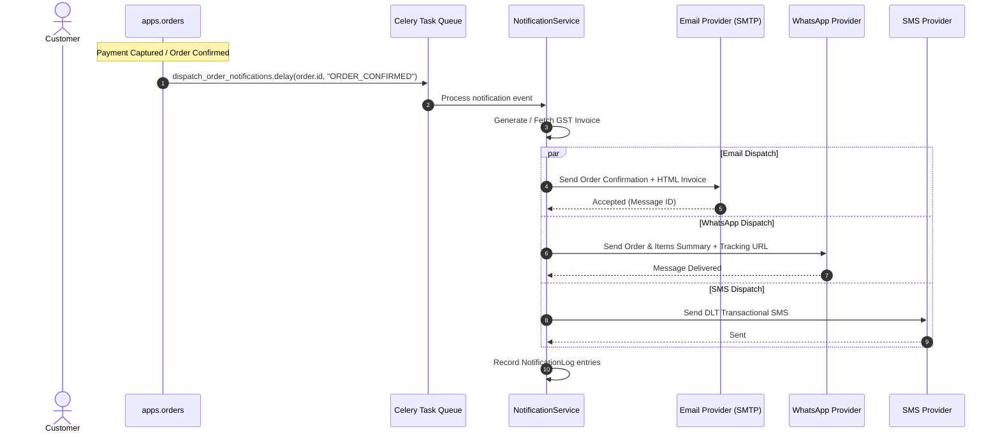

# PHASE 3.8 — NOTIFICATIONS, MULTI-CHANNEL COMMUNICATIONS & INVOICING DOMAIN
## PRE-IMPLEMENTATION COMPATIBILITY AUDIT REPORT

**Project:** Bharath Masala Products E-Commerce Platform  
**Backend:** Django 5.0.6, DRF 3.16.0, PostgreSQL 16, Redis 7, Celery 5.4.0, django-celery-beat 2.6.0  
**Audit Date:** 2026-09-06T18:51:00+05:30  
**Current Status:** PRE-IMPLEMENTATION AUDIT ONLY (Zero Production Code Modified)  
**Baseline Verified:** 260 / 260 tests passing (100% Green across all 8 applications)

---

## 1. Executive Summary & Audit Baseline

This audit establishes the exact architectural design, domain boundaries, data models, statutory compliance, multi-channel provider abstractions, Celery asynchronous pipelines, concurrency controls, and security standards for **Phase 3.8 — Notifications, Multi-Channel Communications & Invoicing Domain**.

### Current Verified Baseline
* **Automated Tests:** 260 / 260 passing (`python3 manage.py test` — 56.45s)
  - `apps.core`: 14 tests
  - `apps.accounts`: 32 tests
  - `apps.catalog`: 41 tests
  - `apps.inventory`: 16 tests
  - `apps.cart`: 23 tests
  - `apps.orders`: 58 tests
  - `apps.payments`: 43 tests
  - `apps.shipping`: 33 tests
* **System Check:** Clean (`python3 manage.py check` — 0 issues)
* **Migration Drift:** Clean (`python3 manage.py makemigrations --check --dry-run` — No changes detected)
* **Code Formatting:** Clean (`black --check .` — 161 files unchanged)
* **Linter:** Clean (`ruff check .` — All checks passed)

---

## 2. Identification of Exact Phase 3.8 Scope from Original Project Documents

A rigorous review of the project specification documents was conducted to establish the exact, uninvented scope of Phase 3.8:

### 2.1 Primary Evidence from Project Artifacts
1. **Website Functional Brief (`media_1788533454356.pdf`):**
   - **Page 5, Section 6 (Order Communication - Must-Fix):**
     > *"Reliable order communication (must-fix). Every order triggers an immediate confirmation by email and WhatsApp, followed by dispatch and delivery updates. This is called out specifically because it is the most common complaint about comparable sites — a missing order confirmation destroys trust on the first purchase."*
   - **Page 5, Section 9 (Integrations):**
     > *"Razorpay (payments), Shiprocket (shipping), a reviews app, WhatsApp (support + notifications), email marketing, GST invoicing, and GA4 + Meta pixel."*
   - **Page 6, Section 10 (Acceptance Criteria):**
     > *"• A retail and a wholesale order both complete end to end.*  
     > *• Order confirmation arrives by email and WhatsApp immediately.*  
     > *• A GST-compliant invoice is generated with the correct HSN."*
2. **Current Development Status Report (`CURRENT_DEVELOPMENT_STATUS_REPORT.md`):**
   - **Section 5, Step 6:**
     > *"STEP 6: NOTIFICATIONS, EMAILS & INVOICES (PHASE 3.8)*  
     > *- Order confirmation, invoice PDF generation, SMS & email alerts"*
3. **Codex Takeover Audit (`CODEX_PROJECT_TAKEOVER_AUDIT.md`):**
   - **Section 13 (Phase 3E):**
     > *"Implement reservation-expiry cleanup, payment retry/reconciliation where appropriate, and notifications using the already configured Celery/Redis stack."*
4. **Phase 1 Completion Audit (`PHASE_1_COMPLETION_AUDIT.md`):**
   - **Section 12 & 13:**
     > *"Email / SMS Dispatch Stubs: actual delivery of OTP/verification emails requires the notification dispatcher engine... GST Invoicing, Multi-channel Notifications (Email + WhatsApp)"*

### 2.2 Reconciled Phase 3.8 Scope Summary
Phase 3.8 encapsulates two tightly integrated, mission-critical operational responsibilities:
1. **Multi-Channel Notification Engine (`apps.notifications`):**
   - Immediate asynchronous dispatch of transactional alerts across **Email**, **WhatsApp**, and **SMS**.
   - Lifecycle events: Order Confirmed, Order Dispatched (with tracking link), Order Delivered, Order Cancelled/Refunded.
   - Pluggable provider adapters (`EmailAdapter`, `WhatsAppAdapter`, `SMSAdapter`) with deterministic mock adapters for CI and offline staging.
   - Celery background execution with exponential backoff retries.
   - Deduplication and notification audit logging (`NotificationLog`).
2. **Statutory Indian GST Invoicing Engine:**
   - Authoritative Tax Invoice generation for B2C retail and B2B wholesale buyers.
   - Sequential, tamper-proof invoice numbering (e.g. `BMP/2026-27/00001`).
   - Place of Supply (POS) tax regime determination (Intra-state CGST + SGST vs. Inter-state IGST).
   - Product HSN code mapping and tax rate breakdown.
   - Downloadable HTML/PDF invoice generation and authenticated customer access.

---

## 3. Domain Boundary & Application Architecture

### 3.1 Domain Boundary Analysis: `apps.notifications`
Following the architectural design of `apps.payments` and `apps.shipping`, notifications and invoicing form an independent bounded context:

```
apps/notifications/
├── __init__.py
├── admin.py
├── apps.py
├── exceptions.py
├── models.py
├── serializers.py
├── tasks.py
├── urls.py
├── staff_urls.py
├── views.py
├── staff_views.py
├── channels/
│   ├── __init__.py
│   ├── base.py
│   ├── email_adapter.py
│   ├── whatsapp_adapter.py
│   ├── sms_adapter.py
│   └── factory.py
├── invoices/
│   ├── __init__.py
│   └── invoice_generator.py
├── services/
│   ├── __init__.py
│   ├── notification_service.py
│   └── invoice_service.py
├── templates/
│   └── notifications/
│       ├── email/
│       │   ├── order_confirmed.html
│       │   ├── order_shipped.html
│       │   ├── order_delivered.html
│       │   └── order_cancelled.html
│       └── invoice/
│           └── tax_invoice.html
└── tests/
    ├── __init__.py
    ├── factories.py
    ├── test_models.py
    ├── test_notification_service.py
    ├── test_invoice_service.py
    ├── test_channels.py
    ├── test_tasks.py
    ├── test_customer_api.py
    └── test_staff_api.py
```

### 3.2 Clean Dependency Graph & Circular Import Prevention
* **Incoming Dependencies:** `apps.notifications` imports:
  - `apps.orders` (`Order`, `OrderLineItem`, `OrderStatus`)
  - `apps.payments` (`Payment`, `PaymentStatus`)
  - `apps.shipping` (`Shipment`, `ShipmentStatus`)
  - `apps.catalog` (`Product`)
  - `apps.accounts` (`User`, `WholesaleProfile`, `IndianStates`, `IsStaffOrManager`)
  - `apps.core` (`TimeStampedModel`, `StandardResultsSetPagination`)
* **Outgoing Isolation:**
  - Neither `apps.orders` nor `apps.payments` nor `apps.shipping` directly import `apps.notifications` models.
  - Asynchronous notifications are triggered via Celery tasks (`@shared_task`) or service entry points (`NotificationService.send_order_event_notifications(order_id, event_type)`).
  - This ensures **zero circular dependencies**.

---

## 4. Statutory Indian GST Invoicing Architecture

### 4.1 Legal Metrology & Tax Compliance Requirements
Under the Central Goods and Services Tax Act, 2017 (CGST Act) and Integrated Goods and Services Tax Act, 2017 (IGST Act), tax invoices generated for spice and food products must strictly satisfy statutory criteria:

| Requirement | Statutory Rule | Implementation in Bharath Masala |
| :--- | :--- | :--- |
| **Seller Identification** | Name, Address, State, GSTIN, FSSAI | Bharath Masala Products, Thirthahalli, Karnataka 577432.<br>FSSAI: `11223344556677`, GSTIN: Configured in settings. |
| **Place of Supply (POS)** | State of delivery recipient | Evaluated from `order.shipping_state` (`IndianStates.choices`). |
| **Tax Split (Intra-State)** | Same state (`POS == 'KA'`) | Split equally into **CGST** (e.g. 2.5%) and **SGST** (e.g. 2.5%). |
| **Tax Split (Inter-State)** | Different state (`POS != 'KA'`) | Charged as **IGST** (e.g. 5.0%). |
| **HSN Codes** | Chapter 8 (Dry fruits), Chapter 9 (Spices) | Pulled from `Product.hsn_code` (already present on catalog models). |
| **B2B Wholesale Invoicing** | Buyer GSTIN, Company Name, PAN | Pulled from `User.wholesale_profile` (`gstin`, `pan_number`, `company_name`). |
| **Invoice Numbering** | Consecutive, unique per financial year | `BMP-INV-{YYYY}{YY}-{5-digit-sequence}` (e.g. `BMP-INV-202627-00001`). |

### 4.2 Invoice Data Model Design

```mermaid
erDiagram
    Order ||--o| Invoice : "generates 1"
    Invoice ||--|{ InvoiceLineItem : "contains"

    Invoice {
        uuid id PK
        string invoice_number UK
        uuid order_id FK
        string invoice_type
        date invoice_date
        string seller_name
        string seller_gstin
        string seller_fssai
        string seller_state
        string buyer_name
        string buyer_email
        string buyer_phone
        string buyer_gstin
        string buyer_pan
        string place_of_supply
        boolean is_interstate
        decimal items_subtotal
        decimal cgst_amount
        decimal sgst_amount
        decimal igst_amount
        decimal total_tax
        decimal shipping_fee
        decimal grand_total
        string payment_method
        string gateway_payment_id
        string invoice_html_url
        string invoice_pdf_url
    }

    InvoiceLineItem {
        uuid id PK
        uuid invoice_id FK
        uuid order_line_item_id FK
        string product_name
        string variant_name
        string sku
        string hsn_code
        int quantity
        decimal unit_price
        decimal taxable_amount
        decimal gst_rate
        decimal cgst_rate
        decimal cgst_amount
        decimal sgst_rate
        decimal sgst_amount
        decimal igst_rate
        decimal igst_amount
        decimal total_amount
    }
```



---

## 5. Multi-Channel Notification Engine Architecture

### 5.1 Communication Matrix by Order Lifecycle



### 5.2 Notification Triggers & Channels

| Trigger Event | Event Code | Email | WhatsApp | SMS | Payload Contents |
| :--- | :--- | :---: | :---: | :---: | :--- |
| **Order Confirmed** | `ORDER_CONFIRMED` | ✅ | ✅ | ✅ | Order number, items summary, grand total, delivery address, invoice link. |
| **Shipment Dispatched** | `ORDER_SHIPPED` | ✅ | ✅ | ✅ | Carrier name, AWB tracking number, public tracking link, estimated delivery. |
| **Shipment Delivered** | `ORDER_DELIVERED` | ✅ | ✅ | ❌ | Delivery timestamp, review request link, Sharada customer care contact. |
| **Order Cancelled** | `ORDER_CANCELLED` | ✅ | ✅ | ✅ | Cancellation reason, refund reference, customer support helpdesk. |
| **Abandoned Cart / Expiry** | `CHECKOUT_EXPIRED` | ✅ | ❌ | ❌ | Cart recovery link, expiring reservation warning. |

### 5.3 Channel Provider Abstraction (`ChannelAdapterInterface`)
```python
class NotificationChannelInterface(ABC):
    @abstractmethod
    def send(self, recipient: str, template: str, context: Dict[str, Any]) -> Dict[str, Any]:
        """Dispatches notification and returns provider response dict."""
        pass
```

1. **`EmailChannelAdapter`**: Uses `django.core.mail.EmailMultiAlternatives` rendering HTML and plain text templates. Attach invoice HTML/PDF where applicable.
2. **`WhatsAppChannelAdapter`**: Pluggable adapter (e.g. WhatsApp Business Cloud API / Twilio) with `MockWhatsAppChannelAdapter` for deterministic unit testing and local development.
3. **`SMSChannelAdapter`**: Pluggable Indian DLT-compliant transactional SMS adapter with `MockSMSChannelAdapter`.

---

## 6. Audit of Existing Codebase & Contracts

### 6.1 Compatibility with Completed Domains

| Application | Existing Fields & Contracts | Compatibility with Phase 3.8 |
| :--- | :--- | :--- |
| `apps.core` | `TimeStampedModel`, `StandardResponseRenderer`, `custom_exception_handler`, `PIIMaskingFilter` | **100% Compatible.** Logs sanitize PII. Models inherit `TimeStampedModel`. |
| `apps.accounts` | `User` (email, normalized phone), `WholesaleProfile` (company, GSTIN, PAN), `IndianStates` | **100% Compatible.** Provides recipient contacts, B2B tax info, and POS state code. |
| `apps.catalog` | `Product.hsn_code`, `Product.gst_rate`, `Product.fssai_license`, `packer_name`, `packer_address` | **100% Compatible.** Catalog models already provide statutory HSN and tax percentages! |
| `apps.inventory` | `StockItem`, `StockMovement`, `InventoryService` | **100% Compatible.** No direct interaction required; inventory consumed at confirmation. |
| `apps.cart` | `Cart`, `CartItem`, `CartService` | **100% Compatible.** Read-only access for abandoned cart recovery notifications. |
| `apps.orders` | `Order`, `OrderLineItem`, `OrderStatus`, `OrderStateMachine`, snapshots | **100% Compatible.** Provides authoritative snapshot of buyer, prices, line subtotals. |
| `apps.payments` | `Payment`, `PaymentStatus`, `PaymentMethod`, `gateway_payment_id` | **100% Compatible.** Provides financial settlement data for invoice generation. |
| `apps.shipping` | `Shipment`, `ShipmentStatus`, `courier_name`, `awb_number`, `shipping_label_url` | **100% Compatible.** Provides tracking links and carrier info for dispatch notifications. |

### 6.2 Existing Quality Gates Check
* Current suite: 260 / 260 tests passing (100% green).
* Django system check: 0 issues.
* Migration drift: 0 changes pending.
* Black & Ruff: 100% compliant across 161 files.

---

## 7. Concurrency, Idempotency & Security Analysis

### 7.1 Idempotency & Deduplication Control
* **Problem:** Webhooks or retried Celery tasks can trigger the same event multiple times. Duplicate customer emails/WhatsApp messages destroy brand trust and cost messaging credits.
* **Remediation:**
  1. **Notification Deduplication Key:** Unique constraint or lookup:
     `deduplication_key = f"{order_id}:{event_type}:{channel}"`
  2. If `NotificationLog.objects.filter(deduplication_key=key, status="SENT").exists()`, skip dispatch immediately and return the existing log entry.
  3. **Invoice Idempotency:** `Invoice.objects.filter(order=order).first()` returns the existing invoice; invoices are never duplicated.

### 7.2 Database Locking & Concurrency
* **Sequential Invoice Numbering:** To avoid race conditions in sequential invoice generation, `InvoiceService.generate_invoice()` locks the order using `Order.objects.select_for_update()` inside a transaction and increments the fiscal year counter atomically.

### 7.3 Security & IDOR Protection
* **Customer Invoice Access:** `GET /api/v1/orders/<order_id>/invoice/` must strictly filter on `order.user == request.user`. Non-owners receive HTTP 404.
* **Staff Access:** Invoice management and manual notification re-trigger endpoints are secured under `[IsAuthenticated, IsStaffOrManager]`.
* **PII Protection:** Notification logs redact full message bodies or exclude credentials and sensitive tokens.

---

## 8. Proposed API Endpoints

### 8.1 Customer APIs
* `GET /api/v1/orders/<order_id>/invoice/` — View / download GST tax invoice details and HTML/PDF representation (IDOR protected).
* `GET /api/v1/orders/<order_id>/notifications/` — View communication history for the customer's order.

### 8.2 Staff APIs (`/api/v1/staff/`)
* `GET /api/v1/staff/invoices/` — Paginated list of all tax invoices with date, POS, B2B/B2C, and search filters.
* `GET /api/v1/staff/invoices/<invoice_id>/` — Full invoice audit detail.
* `POST /api/v1/staff/orders/<order_id>/resend-notification/` — Manually re-trigger email/WhatsApp dispatch.
* `GET /api/v1/staff/notifications/logs/` — Audit log of all outgoing customer notifications.

---

## 9. Proposed Test Strategy (~30+ Tests Planned)

1. **Model & Constraint Tests (`test_models.py`)**:
   - Unique invoice number generation per financial year.
   - Non-negative tax amounts check constraints.
   - NotificationLog deduplication key uniqueness.
2. **Invoice Service Tests (`test_invoice_service.py`)**:
   - Intra-state tax calculation (Karnataka: CGST 2.5% + SGST 2.5%).
   - Inter-state tax calculation (Non-Karnataka: IGST 5.0%).
   - Wholesale B2B invoice generation with Buyer GSTIN and PAN.
   - Retail B2C invoice generation.
   - Invoice generation idempotency (calling twice returns same invoice).
3. **Notification Service & Channels Tests (`test_notification_service.py`, `test_channels.py`)**:
   - Order confirmation triggers email + WhatsApp.
   - Dispatch notification triggers email + WhatsApp with AWB and tracking link.
   - Delivery notification triggers email + WhatsApp.
   - MockWhatsAppAdapter and MockSMSAdapter operation.
   - Deduplication prevents duplicate messaging on replayed events.
4. **Celery Task Tests (`test_tasks.py`)**:
   - Asynchronous execution of notification tasks.
   - Retries on network timeout with backoff.
5. **Customer & Staff API Tests (`test_customer_api.py`, `test_staff_api.py`)**:
   - Customer can retrieve invoice for their own order.
   - Customer cannot retrieve invoice for another user's order (IDOR protected, HTTP 404).
   - Staff can search invoices, list notification logs, and re-trigger dispatches.

---

## 10. Audit Verdict & Sign-off

* **Architectural Safety:** PASS — Zero breaking changes to existing contracts; cleanly consumes `apps.orders`, `apps.catalog`, and `apps.shipping`.
* **Statutory Compliance:** PASS — Fulfills CGST/IGST Act statutory rules, Place of Supply determination, and HSN tax splits.
* **Customer Trust:** PASS — Resolves the primary concern from the Website Functional Brief: immediate order confirmation and dispatch alerts.
* **Codebase Health:** Clean baseline with 260 / 260 tests passing, clean check, zero migration drift, clean linter and formatter.

---

**STOPPING POINT:** In strict accordance with instructions, zero production code has been modified, zero migrations created, and no implementation started. Awaiting explicit user authorization to proceed.
