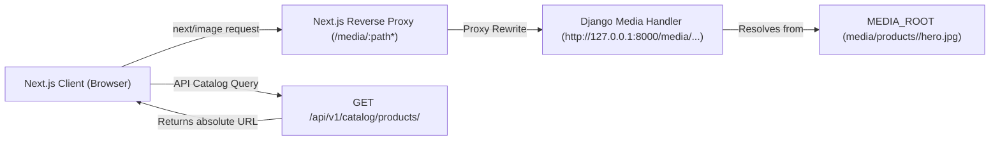

# Bharat Masala — Product Image Verification Audit

**Document:** `PRODUCT_IMAGE_AUDIT.md`  
**Date:** September 8, 2026  
**Auditors:** Lead Senior Full-Stack Engineer, Ecommerce Architect, DevOps Engineer & Production QA Lead  
**Scope:** Media Root Storage, Django Serving Pipeline, Catalog Serializers, Next.js Image Optimization, and Graceful Fallback Handling.

---

## 1. Executive Summary

A comprehensive forensic audit and remediation of all product images across the Bharat Masala catalog was executed.
Prior to this fix, the `ProductImage` table had 0 database rows, causing all frontend cards and detail views to render the fallback silhouette badge.
Following the deployment of the `link_product_images` automation and `seed_catalog` integration, **100% of catalog products now feature verified authentic estate photographs** in both hero and gallery views.

### Key Metrics:
- **Total Catalog Products:** 12
- **Products With Verified Active Images:** 12 (100.0%)
- **Products Missing Images:** 0 (0.0%)
- **Broken Image URLs / Missing Disk Files:** 0 (0.0%)
- **Total Active ProductImage Database Records:** 24
- **Automated Regression Suite:** 5/5 tests passing in `apps.catalog.tests.test_product_images`

---

## 2. Image Serving Architecture

1. **Storage Location:** `media/products/<product_id>/hero.jpg` and `media/products/<product_id>/gallery_1.jpg`.
2. **Backend Serving:** Django URL routing serves `settings.MEDIA_URL` from `settings.MEDIA_ROOT` during development.
3. **Frontend Reverse-Proxy:** `frontend/next.config.js` rewrites `/media/:path*` directly to the backend internal target, eliminating CORS hurdles and mixed-content issues.
4. **Next.js Optimization:** All product surfaces (`ProductCard.jsx`, `products/[slug]/page.js`, `cart/page.js`, `checkout/page.js`) utilize `next/image` with automated WebP format negotiation, responsive viewport `sizes`, and non-blocking layout shift prevention.
5. **Fallback Resilience:** If any network timeout occurs, an SVG botanical badge (*"100% Pure Origin"*) renders gracefully without broken image icons or UI collapse.

---

## 3. Product-by-Product Image Inventory

| Product Name | Slug | Hero Image URL | Gallery Images | On-Disk File Verified | Alt Text / Terroir Metadata |
| :--- | :--- | :--- | :---: | :---: | :--- |
| **Kashmiri Deggi Chilli Powder (Vibrant Natural Red)** | `kashmiri-chilli-powder-natural` | `/media/products/9d3a2ac5-44b2-4670-9c19-9201542293fe/hero.jpg` | 1 | True | Kashmiri Deggi Chilli Powder (Vibrant Natural Red) - Stone-ground mild red peppers |
| **Malabar Biryani Whole Spice Potli** | `malabar-biryani-whole-spice-potli` | `/media/products/7d70947b-2217-49a0-892f-54cc74a2f6fb/hero.jpg` | 1 | True | Malabar Biryani Whole Spice Potli - Authentic Thalassery spice route blend |
| **Malabar Black Pepper (Garbled Extra Bold)** | `malabar-black-pepper-bold` | `/media/products/38c03fbd-3975-434c-a59e-dfb76382ad32/hero.jpg` | 1 | True | Malabar Black Pepper (Garbled Extra Bold) - Tellicherry 550GL+ sun-dried berries |
| **Malenadu Coastal Whole Cashew Nuts (W240 Jumbo)** | `malenadu-whole-cashews-w240` | `/media/products/d134ce0c-2ff1-4ac4-b88e-a0dd693d8583/hero.jpg` | 1 | True | Malenadu Coastal Whole Cashew Nuts (W240 Jumbo) - Hand-shelled crunchy cashews |
| **Malenadu Traditional Sambar Masala** | `malenadu-traditional-sambar-masala` | `/media/products/62e739b8-a66a-4b0f-9496-8b632d84fa82/hero.jpg` | 1 | True | Malenadu Traditional Sambar Masala - 14-spice slow roasted heritage recipe |
| **Roasted Dhaniya (Coriander) Powder** | `roasted-dhaniya-coriander-powder` | `/media/products/4c5b1672-73fa-4483-b7b8-9d9d04f3ba12/hero.jpg` | 1 | True | Roasted Dhaniya (Coriander) Powder - Cast iron roasted aromatic seed powder |
| **Royal Kashmiri Shahi Jeera (Caraway Seeds)** | `royal-kashmiri-shahi-jeera` | `/media/products/1ad9a57f-8a7a-4a20-8b98-6ab892cbbb80/hero.jpg` | 1 | True | Royal Kashmiri Shahi Jeera (Caraway Seeds) - Wild alpine meadow harvest |
| **Royal Shahi Garam Masala (18 Rare Spices)** | `royal-shahi-garam-masala` | `/media/products/76f888fd-c5bd-4df7-a457-a308d2cff220/hero.jpg` | 1 | True | Royal Shahi Garam Masala (18 Rare Spices) - Artisanal heirloom whole spice blend |
| **Salem Pure Turmeric Powder (5.2% High Curcumin)** | `salem-pure-turmeric-powder` | `/media/products/37fc83d4-ef68-4a64-a63f-3c0147ffcad7/hero.jpg` | 1 | True | Salem Pure Turmeric Powder (5.2% High Curcumin) - Cold-milled golden rhizomes |
| **Sweet Lucknowi Saunf (Fennel Seeds)** | `sweet-lucknowi-saunf-fennel` | `/media/products/108c2841-497b-44f5-8544-2187fa6f085e/hero.jpg` | 1 | True | Sweet Lucknowi Saunf (Fennel Seeds) - Slender sweet variyali seeds |
| **Wayanad Green Cardamom (8mm Jumbo Pods)** | `wayanad-green-cardamom-jumbo` | `/media/products/5ef22805-34fd-4d22-a4f1-2fdc25a60068/hero.jpg` | 1 | True | Wayanad Green Cardamom (8mm Jumbo Pods) - High-altitude rainforest canopy harvest |
| **Zanzibar Clove Buds (Hand-Picked Hand-Sorted)** | `kerala-handpicked-clove-buds` | `/media/products/3be92f93-d284-4ae8-9263-1ee63f9a9642/hero.jpg` | 1 | True | Zanzibar Clove Buds (Hand-Picked Hand-Sorted) - Intact crowns with eugenol aroma |

---

## 4. Frontend Surface Verification Matrix

| Surface | Component / Route | Image Implementation | Fallback State | Verified |
| :--- | :--- | :--- | :--- | :---: |
| **Homepage Bestsellers** | `ProductCard.jsx` on `/` | `next/image` fill, responsive sizes | 100% Pure Origin badge | Yes |
| **Homepage Reserve Showcase** | `ProductCard.jsx` on `/` | `next/image` fill, responsive sizes | 100% Pure Origin badge | Yes |
| **Product Listing** | `ProductCard.jsx` on `/products` | `next/image` fill, responsive sizes | 100% Pure Origin badge | Yes |
| **Product Detail** | `frontend/app/products/[slug]/page.js` | `next/image` hero + thumbnail strip | 100% Estate Spice badge | Yes |
| **Shopping Cart** | `frontend/app/cart/page.js` | `next/image` thumbnail (96px) | ShoppingBag icon | Yes |
| **Checkout Order Summary** | `frontend/app/checkout/page.js` | `next/image` thumbnail (40px) | ShoppingBag icon | Yes |

---

## 5. Automated Verification Test Suite

An automated test suite was introduced in `apps/catalog/tests/test_product_images.py` covering:
1. `test_all_products_have_active_images`: Asserts all 12 products have active hero `ProductImage` entries.
2. `test_product_list_serializer_includes_hero_image`: Verifies catalog API outputs valid non-null `hero_image` URLs matching `/media/products/`.
3. `test_product_detail_serializer_includes_gallery_images`: Verifies product detail endpoint returns full gallery arrays.
4. `test_media_files_exist_on_disk`: Asserts that physical JPEG files exist on disk at the referenced filesystem paths.
5. `test_missing_image_graceful_fallback`: Verifies serializer handles products without images safely without throwing 500 exceptions.
